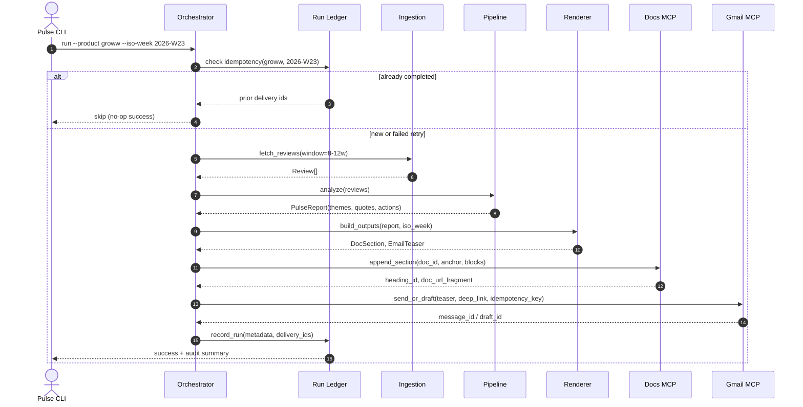

# Weekly Product Review Pulse — Architecture Specification

This document describes the technical architecture for the Groww Play Store review pulse: components, data flows, MCP integration, idempotency, and operational concerns. It extends problemStatement.md.

---

## 1. Goals and Constraints

| Goal | Architectural Implication |
|---|---|
| **Weekly insight report from Play Store reviews** | Batch pipeline, not streaming |
| **Google Doc as system of record** | Append-only sections with stable anchors |
| **Email as notification, not duplicate report** | Teaser + deep link to Doc heading |
| **MCP-only delivery to Google Workspace** | Pulse agent never holds Google OAuth or calls REST directly |
| **Idempotent weekly runs** | Run ledger + deterministic section keys |
| **Auditable history** | Persist run metadata and delivery IDs |
| **Safe LLM usage** | PII scrubbing, quote validation, token/cost caps |

**Current scope:** Groww · Google Play Store · Google Docs MCP + Gmail MCP (both in this repo).

---

## 2. System Context

The pulse agent orchestrates ingestion, analysis, rendering, and delivery. It connects to in-repo MCP servers as an MCP client. Google credentials and API access are confined to those servers.

```mermaid
graph TD
    %% CLI / Scheduler
    CLI[Pulse CLI / Scheduler] --> PulseAgent[Pulse Agent]
    
    subgraph Pulse Agent (MCP Client)
        PulseAgent --> PlayStoreIngest[Play Store Ingestion]
        PulseAgent --> AnalysisPipeline[Analysis Pipeline]
        PulseAgent --> Renderer[Report & Email Renderer]
        PulseAgent --> RunLedger[Run Ledger]
    end
    
    subgraph Remote MCP Server
        ChayMCPServer[Chay MCP Server<br>chay-mcp-server-production.up.railway.app]
    end

    %% Client connection to servers
    PulseAgent -->|SSE / HTTP| ChayMCPServer
    
    %% Output
    ChayMCPServer -->|Write| GoogleDocs[Google Doc: Weekly Review Pulse — Groww]
    ChayMCPServer -->|Compose/Send| StakeholderInboxes[Stakeholder Inboxes]
    
    %% Core Inputs
    PlayStoreIngest -->|Fetch| PlayStoreAPI[Google Play Store API]
    AnalysisPipeline -->|Embeddings| EmbeddingsProvider[OpenAI or HF BGE-small]
    AnalysisPipeline -->|Completion| Groq[Groq API: llama-3.3-70b-versatile]
```

---

## 3. Logical Layers

```
Layer 4 — Delivery (MCP)         [ Docs MCP Tools ] <──> [ Gmail MCP Tools ]
                                             ▲
                                             │
Layer 3 — Output Generation    [ Doc Section Builder ] <──> [ Email Teaser Builder ]
                                             ▲
                                             │
Layer 2 — Reasoning            [ Scrubbed Reviews ] ──> [ UMAP + HDBSCAN ] ──> [ LLM / Quote Validator ]
                                             ▲
                                             │
Layer 1 — Data Retrieval       [ Play Store Scraper ] ──> [ Review Normalizer ] ──> [ PII Scrubber ]
```

| Layer | Responsibility | Must not |
|---|---|---|
| **Data retrieval** | Fetch and normalize Play Store reviews for Groww | Call Google Workspace APIs |
| **Reasoning** | Cluster, summarize, validate quotes | Write to Docs or Gmail |
| **Output generation** | Build structured Doc blocks and email HTML/text | Hold Google OAuth |
| **Delivery** | Append Doc section, send/draft email | Contain clustering/LLM logic |

---

## 4. Repository Layout (Actual)

```
MCPAIAutomation/
├── .env.example                # Environment variables configuration template
├── config/
│   ├── pipeline.yaml           # Core pipeline limits and ML config
│   └── products/
│       └── groww.yaml          # Groww app ID, Google Doc ID, recipients
├── docs/
│   ├── architecture.md         # System design and specifications
│   ├── context.md              # Functional overview and design goals
│   └── implementation_plan.md  # Detailed, phase-wise implementation plan
├── edge-case.md               # Quality and robustness edge cases documentation
├── mcp_servers/
│   └── playstore_mcp/          # Node-based Play Store scraping MCP server
├── problemstatement.txt        # Initial project statement
├── requirements.txt            # Python environment dependencies
├── src/
│   ├── __init__.py
│   ├── config.py               # Pydantic configuration loader
│   ├── ingestion/
│   │   ├── __init__.py
│   │   ├── client.py           # Play Store MCP client wrapper
│   │   ├── models.py           # Data models (Review, RawReview)
│   │   ├── normalizer.py       # Language (Hinglish/ASCII) and emoji scrubbing
│   │   └── run_ingestion.py    # Local review cache CLI entry point
│   └── pipeline/
│       ├── clustering.py       # Embeddings (OpenAI/HF), UMAP, HDBSCAN, TF-IDF
│       ├── quote_validator.py  # Character-exact quote validator
│       ├── scrubber.py         # PII scrubber (phone/email/IDs)
│       └── summarizer.py       # LLM orchestrator and representative samples selection
└── tests/
    ├── __init__.py
    ├── test_config.py          # Config validation tests
    ├── test_ingestion.py       # Normalizer, emoji, Hinglish detection tests
    └── test_pipeline.py        # Embeddings, clustering fallbacks, quote validator tests
```

This layout keeps MCP servers, the pulse pipeline, and configuration separable while shipping everything from one repo.

---

## 5. End-to-End Run Flow



### Run Inputs
* `product`: Product slug (e.g., `groww`).
* `iso_week`: ISO 8601 week (e.g., `2026-W23`).
* `window_weeks`: Rolling review window (e.g. `10`, within 8–12 configurable range).
* `dry_run`: Skip MCP writes (default: `false`).
* `email_mode`: email delivery mode (`draft` or `send`).

### Run Outputs (Audit Record Schema)
```json
{
  "run_id": "groww-2026-W23-abc123",
  "product": "groww",
  "iso_week": "2026-W23",
  "review_count": 872,
  "window_weeks": 10,
  "started_at": "2026-06-08T03:30:00+05:30",
  "completed_at": "2026-06-08T03:42:11+05:30",
  "doc_delivery": {
    "document_id": "...",
    "section_anchor": "groww-2026-W23",
    "heading_id": "...",
    "url": "https://docs.google.com/document/d/...#heading=..."
  },
  "email_delivery": {
    "mode": "draft",
    "message_id": "...",
    "idempotency_key": "groww-2026-W23-email"
  },
  "status": "completed"
}
```

---

## 6. Play Store Ingestion

### Responsibilities
1. Resolve Groww’s Play Store listing from product config (`play_store_app_id` or package name).
2. Scrape public reviews within the configured date window (8–12 weeks).
3. Paginate until window boundary or no more pages.
4. Normalize to a canonical Review model.

### Review Models
* **Raw cache** (`reviews_raw.json`) — full scrape payload per review:
  * `text` (string): Raw review body
  * `rating` (int): 1–5 stars
  * `published_at` (datetime): UTC; used for window filtering
* **Normalized pipeline input** (`reviews_normalized.json`) — what Phase 2 consumes:
  * `text` (string): Review body passing quality filters
  * `rating` (int): 1–5 stars

### Normalization Logic
Phase 1 normalization filters reviews before caching to data/reviews_normalized.json:
* **Word Count**: Discards reviews containing less than 8 words (min_words: 8).
* **Emoji-Free**: Discards reviews containing emojis or symbols. The filter pattern includes both standard emojis (`\U00010000-\U0010ffff`), dingbats (`\u2600-\u27bf`), and common dingbat symbols like stars (`\u2b50` / ⭐) that can leak through.
* **English-Only**: Discards non-English reviews. To prevent Hinglish (Hindi written in Latin script) from bypassing ASCII-only checks, a robust language detection filter or custom dictionary-based Hinglish stop-words filter is applied.
* **Cache Alignment**: The normalized cache is strictly standard `{text, rating}` only, removing all raw metadata (like username, raw timestamp, image, or IDs) to maintain a minimal analysis footprint.
* **Recency Verification**: Ensures reviews fall strictly within the rolling 8–12 week window based on their UTC publication timestamps.

### Design Decisions
* Cache raw and normalized pulls under `data/cache/{product}/{date}/` (`reviews_raw.json`, `reviews_normalized.json`, `manifest.json`) to avoid re-scraping on retries and support auditability.
* Deduplicate raw reviews by hash of `(text, rating, published_at)` before normalization.
* Implement rate limiting with backoff.
* Designed with an interface `ReviewSource` to allow future App Store or other adapters without changing the downstream pipeline.

---

## 7. Analysis Pipeline

* **Input**: `list[Review]` containing `{ text, rating }`.
* **ML Floor**: If normalized review count is $<20$, the pipeline aborts.

```
[ Scrubbed Reviews ]
         │
         ▼
  [ Count >= 20? ] ──(No)──> [ Abort Run ]
         │
       (Yes)
         ▼
[ OpenAI / HF BGE-small ] ──> [ UMAP ] ──> [ HDBSCAN (min_size=5) ]
                                                          │
                                                          ▼
                                                  [ Rank Clusters ]
                                                          │
                                                          ▼
                                                  [ LLM (Groq) ]
                                                          │
                                                          ▼
                                                  [ Quote Validator ]
```

### 7.1 PII Scrubbing
Before embedding or LLM submission:
* Emails redacted $\rightarrow$ `[EMAIL]`
* Phone numbers (IN format) redacted $\rightarrow$ `[PHONE]`
* Long numeric sequences (PAN/Aadhaar) redacted $\rightarrow$ `[ID]`
* URLs with tokens redacted path/query.

### 7.2 Embeddings and Clustering Configuration
* **Model**: OpenAI `text-embedding-3-small` (default) or Hugging Face `BAAI/bge-small-en-v1.5` via the Hugging Face Inference API (if `HF_TOKEN` is configured or `provider: huggingface` is selected).
* **UMAP parameters**: `n_neighbors=15`, `n_components=5`, `metric="cosine"`, `random_state=42`.
* **HDBSCAN parameters**: `min_cluster_size=5`, `min_samples=3`.
* **Cluster Ranking Formula**: 
  $$\text{Score} = \text{Cluster Size} \times (6 - \text{Average Rating})$$
  This formula prioritizes large, low-star complaint themes (e.g. 1-star issues).
* **Deterministic Sample Selection**: 
  To generate high-quality themes, the `max_samples_per_cluster` representative reviews are selected deterministically by sorting candidate reviews in the cluster by:
  1. `rating` ascending (prioritizing lower ratings/complaints).
  2. `text` length descending (prioritizing descriptive, detailed reviews over short statements).
* **Pipeline Fallbacks**:
  To prevent failure due to sandbox environments without C++ compilation (making UMAP/HDBSCAN import fail) or API key outages, a robust fallback clustering pipeline is implemented:
  * Falls back to scikit-learn `TfidfVectorizer` (with English + customized Hinglish/Hindi stop-words) + `KMeans` (where $K$ is set based on `max_themes`).
* **Identity and Recency Uniqueness**:
  Deduplication checks are run to ensure duplicate reviews are removed to maintain identity uniqueness. Reviews are dynamically filtered to ensure strict temporal recency relative to the current week window.

### 7.3 LLM Summarization & Groq Rate Limits
* **Provider**: Groq — `llama-3.3-70b-versatile`.
* **Groq API Rate Limits & Mitigation**:
  * **Requests per minute (RPM) limit: 30**: Capped using sequential rate limit sleeps of $\ge 2$ seconds between requests.
  * **Requests per day (RPD) limit: 1K**: Prevented from breaching by ledger checks and daily caps on scheduled orchestrator jobs.
  * **Tokens per minute (TPM) limit: 12K**: Enforce a maximum token budget of 12K per run; estimate prompts before calling, terminating cleanly if limits would be breached.
  * **Tokens per day (TPD) limit: 100K**: Tracked cumulatively via the run ledger SQLite database, blocking downstream requests if the daily limit is breached.
* **Output Schema**: Structured JSON matching:
  ```json
  {
    "theme_name": "App performance & bugs",
    "summary": "Lag and crashes during trading hours; session timeouts.",
    "quotes": ["The app freezes exactly when the market opens..."],
    "action_ideas": [
      {
        "title": "Stabilize peak-time performance",
        "detail": "Scale infra during market hours; improve crash visibility."
      }
    ]
  }
  ```

### 7.4 Quote Validation
* Normalize whitespace and punctuation on quote and candidate review texts.
* Require case-insensitive substring match against at least one scrubbed review in the same cluster.
* Accept ellipsis truncation (`...`) as prefix match when the LLM shortens a long quote.
* Quotes failing validation are dropped. If a theme loses all quotes, re-prompt the LLM once; if it fails again, omit the theme.

---

## 8. Output Generation

### 8.1 Google Doc Section Structure
* **Heading 1**: `Groww — Weekly Review Pulse — 2026-W23`
* **Paragraph**: `Period: Last 10 weeks (rolling) · Source: Google Play Store · Generated: 2026-06-08 IST`
* **Heading 2**: `Top themes` (bulleted list)
* **Heading 2**: `Real user quotes` (bulleted list)
* **Heading 2**: `Action ideas` (bulleted list)
* **Heading 2**: `Who this helps` (table)

### 8.2 Section Anchor (Idempotency)
* **Anchor Key**: `{product}-{iso_week}` (e.g. `groww-2026-W23`)
* **Heading Text**: `Groww — Weekly Review Pulse — 2026-W23`
* **Workflow**: Docs MCP searches for existing headings matching the anchor key. If found, returns the existing URL and heading ID without appending.

### 8.3 Email Teaser
* **Subject**: `Groww Weekly Review Pulse — 2026-W23`
* **Body**: 3–5 bullet headlines + deep link anchor (`#heading={heading_id}`). Complete reports reside only in the Doc.

---

## 9. MCP Server Architecture

The pulse agent runs as an MCP Client and connects to the unified external MCP server (`ChayMCPServer`) hosted on Railway via Server-Sent Events (SSE) HTTP transport.

```
                  ┌───────────────┐
                  │  Pulse Agent  │
                  └───────┬───────┘
                          │ (SSE / HTTP)
                          ▼
             ┌─────────────────────────┐
             │     Chay MCP Server     │
             │ (Railway Hosted Server) │
             └────┬───────────────┬────┘
                  │               │
         Docs API │               │ Gmail API
                  ▼               ▼
           [ Google Docs ]  [ Gmail Outbox ]
```

### 9.1 Google Docs MCP Tools
* `find_section_by_anchor(document_id, anchor)`
* `append_section(document_id, anchor, blocks[], insert_at_end)`
* `get_document_url(document_id, heading_id?)`

### 9.2 Gmail MCP Tools
* `check_idempotency(idempotency_key)`
* `create_draft(to[], subject, html_body, text_body, idempotency_key)`
* `send_email(to[], subject, html_body, text_body, idempotency_key)`

*Idempotency Key Format:* `{product}-{iso_week}-email`

---

## 10. Run Ledger and Audit

A local SQLite database tracks executions.

### Table: `runs`
* `run_id` (TEXT PK)
* `product` (TEXT)
* `iso_week` (TEXT)
* `status` (TEXT: `pending`, `completed`, `failed`)
* `review_count` (INTEGER)
* `window_weeks` (INTEGER)
* `started_at`, `completed_at` (TEXT)
* `error_message` (TEXT nullable)

### Table: `deliveries`
* `run_id` (FK $\rightarrow$ `runs`)
* `channel` (TEXT: `google_doc`, `gmail`)
* `external_id` (TEXT: `heading_id`, `message_id`, `draft_id`)
* `url` (TEXT)
* `idempotency_key` (TEXT nullable)

---

## 11. Configuration Files

### Product Config (`config/products/groww.yaml`)
```yaml
product: groww
display_name: Groww
play_store:
  app_id: com.nextbillion.groww
ingestion:
  window_weeks: 10
  min_reviews: 20
  max_reviews: 5000
  min_words: 8
  allowed_language: en
delivery:
  google_doc_id: "<SHARED_DOC_ID>"
  email:
    recipients:
      - product-leads@example.com
      - support-leads@example.com
    default_mode: draft
```

### Pipeline Config (`config/pipeline.yaml`)
```yaml
embedding:
  provider: openai
  model: text-embedding-3-small
  batch_size: 64
clustering:
  umap:
    n_neighbors: 15
    n_components: 5
    metric: cosine
  hdbscan:
    min_cluster_size: 5
    min_samples: 3
summarization:
  provider: groq
  model: llama-3.3-70b-versatile
  max_themes: 5
  max_tokens_per_run: 12000
  max_samples_per_cluster: 8
  max_output_tokens_per_theme: 800
  request_interval_seconds: 2
safety:
  scrub_pii: true
  max_review_chars: 2000
```

---

## 12. CLI and Scheduling

### CLI Interface
* `pulse run --product groww [--iso-week YYYY-Www]`
* `pulse backfill --product groww --from YYYY-Www --to YYYY-Www`
* `pulse dry-run --product groww`
* `pulse status --product groww --iso-week YYYY-Www`

### Scheduling
Cron / GitHub Actions / Cloud Scheduler invokes `pulse run --product groww` weekly (e.g. Monday 09:00 IST).

---

## 13. Security and Safety

* **OAuth Isolation**: Credentials reside only in MCP env configurations, never committed.
* **Scrubbing**: Scrub PII before LLM calls and reporting.
* **Prompt Injection**: XML/fenced block shielding.
* **Cost Cap**: Strictly enforced token and execution limits.

---

## 14. Error Handling and Partial Failure

* **Ingestion/Pipeline failure**: Abort, mark ledger `failed`.
* **Doc delivery succeeds, Gmail fails**: Ledger marked `failed`. Retrying executes a safe Docs update (idempotent no-op) and retries the Gmail trigger.
* **Gmail succeeds, ledger write fails**: Log critical alert; MCP idempotency prevents duplicate email send on retry.

---

## 15. Related Documents
* [problemstatement.txt](file:///c:/Nextleap%20Projects%20Git/MCPAIAutomation/problemstatement.txt) — product intent and scope
* [context.md](file:///c:/Nextleap%20Projects%20Git/MCPAIAutomation/docs/context.md) — functional context
* [implementation_plan.md](file:///c:/Nextleap%20Projects%20Git/MCPAIAutomation/docs/implementation_plan.md) — phase-wise timeline
* [edge-case.md](file:///c:/Nextleap%20Projects%20Git/MCPAIAutomation/edge-case.md) — edge cases and mitigation strategies
