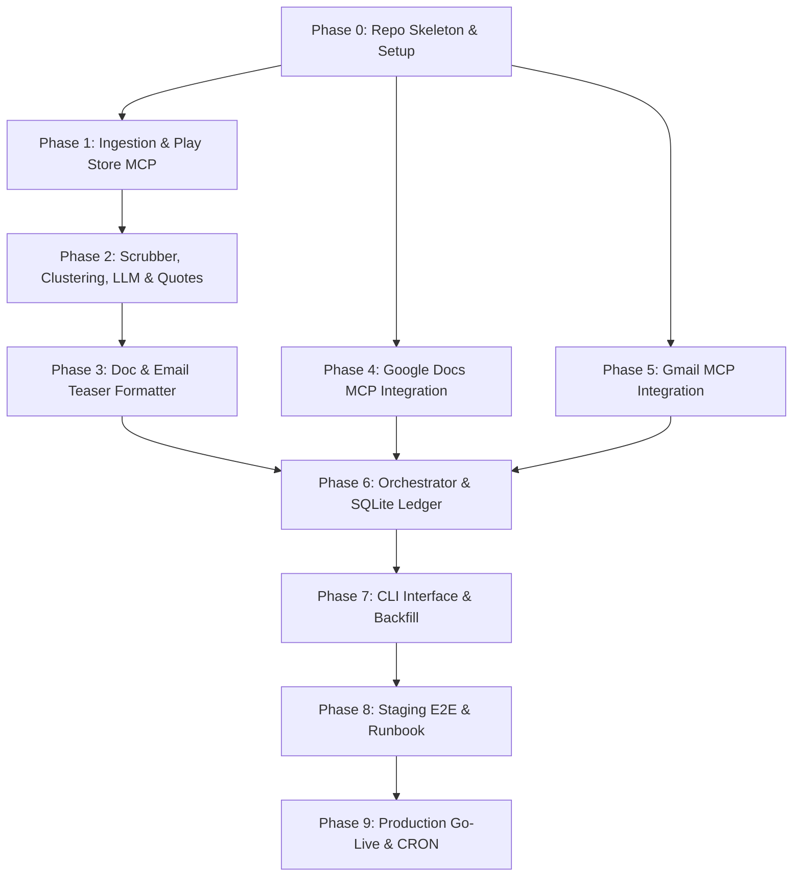

# Detailed Implementation Plan — Groww Weekly Review Pulse

This document outlines the detailed, phase-wise implementation plan for the Groww Play Store Weekly review pulse system.

---

## 1. Requirements Traceability

The table below maps the functional and non-functional requirements from the [Problem Statement](file:///c:/Nextleap%20Projects%20Git/MCPAIAutomation/docs/context.md) to specific implementation deliverables:

| Req ID | Requirement Description | Component / Phase | Verification Method |
|---|---|---|---|
| **REQ-01** | Ingest reviews from Google Play Store for Groww (8-12 weeks rolling) | Phase 1 (Ingestion MCP) | MCP Tool calls list validation |
| **REQ-02** | Cluster feedback and extract themes (Scrub -> embed -> UMAP -> HDBSCAN flow) | Phase 2 (Clustering Pipeline) | Vector comparison unit tests |
| **REQ-03** | LLM Theme name, description, and action ideas generation | Phase 2 (LLM Pipeline) | Structured JSON output validation |
| **REQ-04** | Verbatim check validation on all user quotes | Phase 2 (Quote Validator) | Character-by-character substring matching unit tests |
| **REQ-05** | Append new weekly section to canonical Google Doc (raw text content append, no rich formatting) | Phase 3 & 4 (Docs MCP integration) | Document state validation check |
| **REQ-06** | Send teaser email with deep link (heading link) to the doc section | Phase 3 & 5 (Gmail MCP integration) | Sent message contents verification |
| **REQ-07** | Idempotent runs: prevent duplicate sends / doc sections | Phase 6 (SQLite Ledger) | Database lookup block checks |
| **REQ-08** | Command-Line Interface supporting week-backfills and dry-runs | Phase 7 (CLI interface) | Command execution tests |
| **REQ-09** | PII Scrubbing (emails, phone numbers) before LLM submission | Phase 2 (PII Scrubber) | PII matching regex test suite |

---

## 2. Environment Progression

```
[ Local Development ] ────> [ Staging / E2E ] ────> [ Production / Go-Live ]
  - Mock reviews fallback     - Dry-run validation     - Canonical Doc Target
  - Local reports file        - Staging Doc Target     - Scheduled Monday runs
  - Test SQLite DB            - Mock Workspace MCPs    - OAuth production tokens
```

* **Local Development**: Runs in isolated sandbox. MCP outputs fall back to local file logs (e.g. `data/reports/` and `data/emails/`) when credentials are not configured.
* **Staging E2E**: Integrates with live, staging Google Workspace accounts. Validates token refresh and security policies.
* **Production**: Operates under scheduled CRON jobs. Commits updates to the canonical company Google Doc and notifies production mailing lists.

---

## 3. Timeline & Parallelization

* **Total Indicative Duration**: 5–7 weeks.
* **MCP Efficiency Savings**: Parallelizing the Workspace MCP integration (Phases 4–5) with the Core Ingestion/Clustering pipeline (Phases 1–3) saves approximately 1–2 weeks of design-to-build effort.

### Phase Dependency Diagram



---

## 4. Phase-Wise Implementation

### Phase 0: Repo Skeleton, Config, Tooling, CI Smoke
* **Status**: `[x] COMPLETED`
* **Tasks**:
  - `[x]` Set up Python virtual environment (`.venv`) and initial dependencies (`mcp`, `scikit-learn`, `openai`, `pytest`).
  - `[x]` Create folder layout (`src/`, `tests/`, `mcp_servers/`).
  - `[x]` Implement unified configuration system (`src/config.py`).
* **Deliverables**: Python virtual environment layout, `requirements.txt`, and system-wide configurations.
* **Exit Criteria**: `pytest` runs and passes basic dummy assertions.
* **Risks & Mitigation**: Version mismatches on packages. Mitigated by specifying exact constraints in `requirements.txt`.
* **Dependencies**: None.

---

### Phase 1: Groww Play Store Ingestion & Review Model
* **Status**: `[x] COMPLETED`
* **Tasks**:
  - `[x]` Initialize the Node.js custom Play Store MCP server (`mcp_servers/playstore_mcp/`).
  - `[x]` Implement `get_play_store_reviews` tool utilizing `google-play-scraper`.
  - `[x]` Connect python subprocess stdio client logic in `src/ingestion/client.py`.
* **Deliverables**: Node.js custom MCP package structure and review fetching Python SDK client.
* **Exit Criteria**: Running Node MCP server exposes tools correctly.
* **Risks & Mitigation**: Play Store web layout updates. Mitigated by using a well-maintained scraper package.
* **Dependencies**: Phase 0.

---

### Phase 2: PII Scrubber, Clustering, LLM & Quote Validation
* **Status**: `[x] COMPLETED`
* **Tasks**:
  - `[x]` Build regex-based PII scrubber ([scrubber.py](file:///c:/Nextleap%20Projects%20Git/MCPAIAutomation/src/pipeline/scrubber.py)) matching phone numbers and emails.
  - `[x]` Implement standard clustering pipeline supporting both OpenAI `text-embedding-3-small` and Hugging Face `BAAI/bge-small-en-v1.5` embeddings (Scrub -> embed -> UMAP -> HDBSCAN flow).
  - `[x]` Fix normalizer issues: resolve Hinglish/Hindi ASCII leakage, and expand emoji filter regex for star symbols (`\u2b50` / ⭐).
  - `[x]` Align pipeline data shape to only read and cache `{text, rating}` (no metadata objects like IDs/usernames/timestamps).
  - `[x]` Implement robust fallback pipeline: fallback to TF-IDF + K-Means if OpenAI embeddings, UMAP, or HDBSCAN fails (e.g. due to compilation or rate limits).
  - `[x]` Implement LLM completion call and custom verbatim character-matching quote extractor ([summarizer.py](file:///c:/Nextleap%20Projects%20Git/MCPAIAutomation/src/pipeline/summarizer.py)).
  - `[x]` Implement cluster ranking formula: $\text{Score} = \text{Cluster Size} \times (6 - \text{Average Rating})$ to prioritize large, low-star complaint themes.
  - `[x]` Implement deterministic sample selection: select top representative reviews per cluster by sorting reviews by rating ascending (prioritize lower ratings) and character length descending (prioritize detailed, descriptive feedback).
  - `[x]` Implement identity and recency mechanisms: deduplicate identical reviews to maintain identity uniqueness, and filter using timestamps to enforce the 8-12 weeks rolling window.
  - `[x]` Align LLM token budgeting and request rate-limiting logic with Groq limits.
* **Deliverables**: Scrubbing module, optimized UMAP + HDBSCAN clustering pipeline supporting OpenAI and Hugging Face BGE-small embeddings with TF-IDF + K-Means fallback, quote validation functions, rate-limiting handlers, and unit/integration tests.
* **Exit Criteria**: Pytest runs pass for normalizer, PII regex, custom stop-words, clustering flow, fallback path, and verbatim string checks.
* **Groq API Rate Limits & Mitigation (llama-3.3-70b-versatile)**:
  * **Requests per minute (RPM) limit (30)**: Enforce a sequential delay of $\ge 2$ seconds between API calls to Groq.
  * **Requests per day (RPD) limit (1K)**: Enforce a running count check in the SQLite run ledger to prevent exceeding daily allocations.
  * **Tokens per minute (TPM) limit (12K)**: Enforce a maximum token budget of 12K per run; estimate prompts before calling, terminating cleanly if limits would be breached.
  * **Tokens per day (TPD) limit (100K)**: Track daily cumulative token consumption via the sqlite database and block runs if limits are exceeded.
* **Risks & Mitigation**: Local compilation errors for UMAP/HDBSCAN in sandbox environments. Mitigated by implementing a robust fallback to scikit-learn TF-IDF + K-Means pipeline with optimized custom vocabulary and custom stop-words.
* **Dependencies**: Phase 1.

---

### Phase 3: Doc Section Blocks & Email Teaser Rendering
* **Status**: `[x] COMPLETED`
* **Tasks**:
  - `[x]` Build markdown output generator in `src/delivery/client.py`.
  - `[x]` Implement Gmail teaser template formatter with deep link anchor support.
  - `[x]` Note: Google Docs MCP does not support rich formatting; the report is generated as plain text layout to be appended directly.
* **Deliverables**: Report templates and formatting utility classes.
* **Exit Criteria**: Correct report structure plain-text output in memory.
* **Risks & Mitigation**: Code changes break formats. Mitigated by keeping templates parameterized.
* **Dependencies**: Phase 2.

---

### Phase 4: Google Docs MCP Integration (Idempotent Append)
* **Status**: `[x] COMPLETED`
* **Tasks**:
  - `[x]` Implement Docs MCP communication logic in `src/delivery/client.py` connecting to `chay-mcp-server-production.up.railway.app` via SSE.
  - `[x]` Create fallback to local markdown files when credentials or servers are offline.
  - `[x]` Note: Since Google Docs MCP does not support rich formatting, we perform a plain text append of the generated report section.
* **Deliverables**: Google Docs API call adapter via MCP server tools.
* **Exit Criteria**: Executing local runs creates files under `data/reports/` when dry-run/mock mode is active.
* **Risks & Mitigation**: Loss of API access. Mitigated by file fallback mechanisms.
* **Dependencies**: Phase 0 (Runs in parallel with Phases 1–3).

---

### Phase 5: Gmail MCP Integration (Send & Idempotency)
* **Status**: `[x] COMPLETED`
* **Tasks**:
  - `[x]` Implement Gmail MCP communication logic in `src/delivery/client.py` connecting to `chay-mcp-server-production.up.railway.app` via SSE.
  - `[x]` Create local draft email file fallback under `data/emails/`.
* **Deliverables**: Gmail API call adapter via MCP server tools.
* **Exit Criteria**: Executing local runs saves drafts locally when mock mode is active.
* **Risks & Mitigation**: SMTP/API failures. Mitigated by local file caching.
* **Dependencies**: Phase 0 (Runs in parallel with Phases 1–3).

---

### Phase 6: Orchestrator & SQLite Run Ledger
* **Status**: `[x] COMPLETED`
* **Tasks**:
  - `[x]` Implement SQLite audit log database driver ([database.py](file:///c:/Nextleap%20Projects%20Git/MCPAIAutomation/src/state/database.py)).
  - `[x]` Set up runs tracking state logic to verify previous execution success/failures.
* **Deliverables**: Database initialization scripts, runs schema, and state checks.
* **Exit Criteria**: Running python tests validates database insert and query state handlers.
* **Risks & Mitigation**: SQLite concurrency locks. Mitigated by keeping connections short-lived.
* **Dependencies**: Phases 3, 4, 5.

---

### Phase 7: CLI Interface (Run, Dry-run, Backfill, Status)
* **Status**: `[x] COMPLETED`
* **Tasks**:
  - `[x]` Implement the main CLI arguments parses and execution driver ([main.py](file:///c:/Nextleap%20Projects%20Git/MCPAIAutomation/src/main.py)).
  - `[x]` Add support for `--dry-run` to log report and email outputs without committing writes.
  - `[x]` Add support for `--week-label` to allow manual ISO week backfill runs.
* **Deliverables**: Python CLI orchestrator program and environment-aware console stream encoders.
* **Exit Criteria**: E2E local execution returns status success logs and matches mock data structures.
* **Risks & Mitigation**: Console emoji crashes on Windows. Mitigated by stream reconfiguration to UTF-8.
* **Dependencies**: Phase 6.

---

### Phase 8: Staging E2E, Safety Audit, Runbook
* **Status**: `[ ] PENDING`
* **Tasks**:
  - Connect script to unified live staging Google Docs and Gmail MCP server (`chay-mcp-server-production.up.railway.app`) via SSE.
  - Run comprehensive safety audit on PII filter effectiveness.
  - Write step-by-step runbook for system monitoring and manual overrides.
* **Deliverables**: E2E verified logs, safety audit sign-off, and `docs/runbook.md`.
* **Exit Criteria**: Staging document section is appended successfully via the unified remote `chay-mcp-server-production.up.railway.app` MCP server.
* **Risks & Mitigation**: OAuth scopes limits. Mitigated by requesting narrow, read-write specific workspace grants.
* **Dependencies**: Phase 7.

---

### Phase 9: Production Doc, Scheduler, Go-Live
* **Status**: `[ ] PENDING`
* **Tasks**:
  - Configure production target Google Doc ID.
  - Deploy orchestrator to runner environment (e.g. GitHub Actions, local server runner, or task scheduler).
  - Schedule cron triggers for Monday morning IST.
  - Enable production send-mode for notifications.
* **Deliverables**: Production scheduler configuration files (YAML/Cron) and live reporting channel.
* **Exit Criteria**: Weekly automated runs execute successfully without manual intervention.
* **Risks & Mitigation**: Credentials expiry. Mitigated by setting up long-lived service account tokens or token refresh notifications.
* **Dependencies**: Phase 8.
