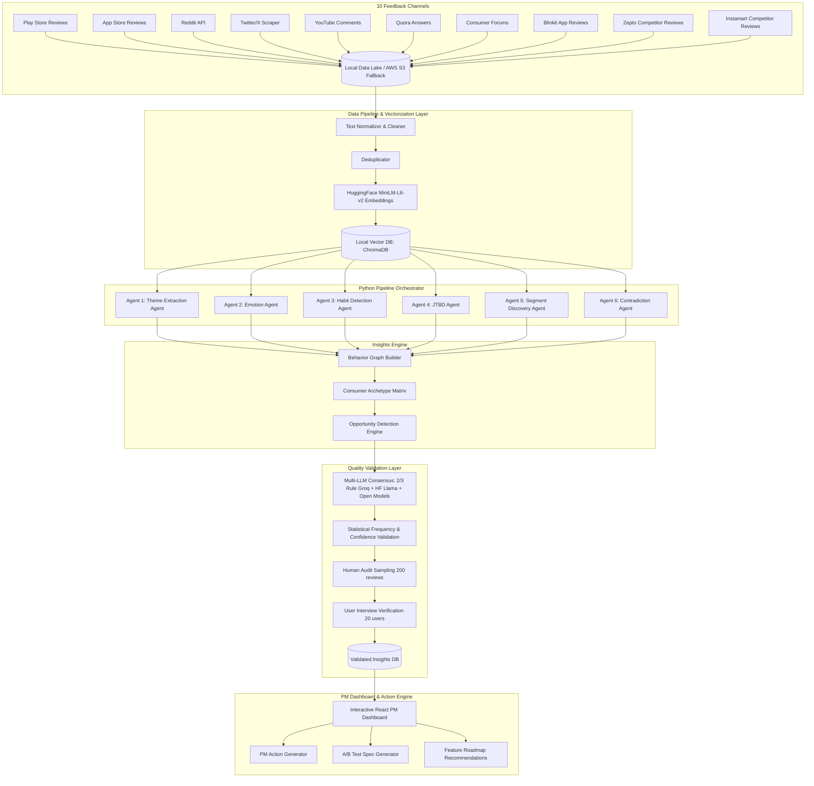
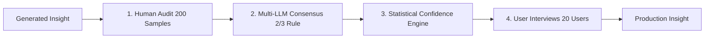
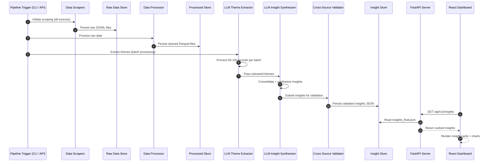

# Architecture: AI-Powered Discovery Engine — Blinkit Category Exploration

This document describes the system architecture for an AI-powered discovery engine that analyzes public user feedback at scale to surface actionable insights about why Blinkit users don't explore new product categories. It is derived from [context.md](file:///c:/Nextleap%20Projects%20Git/ProductManagerFellowshipGraduationProject/docs/context.md).

---

## 1. Design Goals

| Goal | Architectural Implication |
|---|---|
| **Insight-driven discovery** | Multi-source data ingestion pipeline feeding an LLM-powered analysis layer that extracts structured themes and insights |
| **Scale over manual effort** | Automated scrapers and crawlers collect thousands of reviews/discussions — not a manual copy-paste exercise |
| **Source-backed insights** | Every insight traces back to specific reviews, threads, or discussions with citation metadata |
| **Reproducible workflow** | End-to-end pipeline can be re-run on demand to refresh data and regenerate insights |
| **Multi-source triangulation** | Themes validated across App Store, Play Store, Reddit, Twitter/X, and forums — not dependent on a single channel |
| **Blinkit-specific focus** | Scrapers, search queries, and analysis prompts are tuned specifically to Blinkit and quick-commerce behaviour in India |
| **Presentation-ready output** | Final insights rendered in a premium interactive dashboard — not raw JSON dumps |

---

## 2. High-Level Architecture



---

## 3. System Components

### 3.1 Data Collection & Ingestion Layer

Data is collected from 10 distinct sources to ensure comprehensive multi-channel coverage:

| Source | Scraping / Ingestion Method | Target Volume | Primary Signals Extracted |
|---|---|---|---|
| **Play Store Reviews** | Python `google-play-scraper` | 10,000+ reviews | App performance, delivery complaints, grocery stickiness |
| **App Store Reviews** | Python `app-store-scraper` | 5,000+ reviews | UI friction, iOS feature requests, checkout bugs |
| **Reddit Discussions** | PRAW API across `r/india`, `r/bangalore`, etc. | 2,000+ threads | Organic discussions on Q-commerce pricing & habits |
| **Twitter/X Posts** | Apify Twitter Scraper / `snscrape` | 3,000+ tweets | Real-time sentiment, viral complaints, missing categories |
| **YouTube Comments** | YouTube Data API v3 | 1,500+ comments | Visual unboxing reviews, product quality complaints |
| **Quora Answers** | Web Crawlers (`requests` + `BeautifulSoup`) | 500+ answers | Deep comparisons between Blinkit vs. Zepto vs. Instamart |
| **Consumer Forums** | Web Crawlers (ConsumerComplaints.in, etc.) | 500+ threads | Hard quality failures, trust breaches, refund issues |
| **Blinkit Reviews** | Direct App Feedback Scrapers | 5,000+ reviews | On-platform product discovery complaints |
| **Zepto Reviews** | Competitor Play Store/App Store Scraper | 3,000+ reviews | Competitor discovery UX strengths & category features |
| **Instamart Reviews** | Competitor Play Store/App Store Scraper | 3,000+ reviews | Competitor basket building & cross-category promos |

#### Storage Infrastructure: AWS S3 Raw Data Lake
* All raw scraped payloads are saved as immutable JSONL blobs in an AWS S3 bucket (`data/raw/ (with optional s3://blinkit-discovery-engine-raw/ fallback)`).
* Schema preserves raw text, metadata, scrape timestamp, and source origin tag.

---

### 3.2 Processing & Vectorization Layer

1. **Text Cleaner & Normalizer:** Removes reviews with $<8$ words, emojis, HTML artifacts, and non-English scripts (Devanagari, Tamil, Telugu, etc.).
2. **Deduplicator:** SHA-256 hash exact dedup + Jaccard similarity near-dedup ($\ge 85\%$).
3. **Embeddings:** Text chunks are vectorized using **Sentence-Transformers `sentence-transformers/all-MiniLM-L6-v2`** (Hugging Face / Open Source)**.
4. **Vector Database:** High-dimensional vector index stored in **ChromaDB / FAISS (Local Vector Database)** for semantic similarity search and RAG retrieval across the 6 sub-agents.

---

### 3.3 Multi-Agent AI Analysis Layer (The 6 Sub-Agents)

Instead of a single monolithic LLM prompt, the engine orchestrates **6 specialized AI agents** (built using Python pipeline orchestrator):

#### Agent 1 — Theme Extraction Agent
* **Objective:** Extract macro operational and product themes across the 50,000+ feedback corpus.
* **Prompt Strategy:** Categorize friction into operational vs. product discovery vs. pricing vs. trust buckets.
* **Output Example:**
  - Late Delivery: 14%
  - Product Discovery Issues: 21%
  - Search Problems: 9%
  - Trust Issues: 6%
  - Habit Purchases: 18%
  - Price Sensitivity: 12%

#### Agent 2 — Emotion Agent
* **Objective:** Uncover underlying psychological and emotional states driving user behavior.
* **Core Premise:** Commerce is emotional. Users rarely articulate emotional blockers directly.
* **Example:**
  - Review: *"I always order the same things because trying new products feels risky."*
  - Extracted Emotion: **Risk Perception, Uncertainty, Cognitive Decision Fatigue**.

#### Agent 3 — Habit Detection Agent (Secret Weapon)
* **Objective:** Convert unstructured review text into actionable behavioral science by extracting Habit Loops (Trigger $\rightarrow$ Action $\rightarrow$ Reward).
* **Example Output:**
  - **Trigger:** Sunday Grocery Need / Sudden Out-of-Stock Emergency
  - **Action:** Open App & Reorder Previous Basket
  - **Reward:** 10-Minute Instant Checkout & Peace of Mind
  - **Result:** Exploration of new categories drops to 0%.

#### Agent 4 — Jobs-To-Be-Done (JTBD) Agent
* **Objective:** Identify the core human needs customers are hiring the app to solve, transcending static catalog categories.
* **Example Output:**
  - *Legacy Category:* Personal Care $\rightarrow$ **JTBD Need:** *"Look presentable for an impromptu office meeting in 20 minutes."*
  - *Legacy Category:* Snacks $\rightarrow$ **JTBD Need:** *"Quick stress-relief break during late-night coding sessions."*

#### Agent 5 — Segment Discovery Agent
* **Objective:** Discover emergent user archetypes based on behavioral patterns and determine their specific needs.
* **Archetypes Identified:**
  1. **Routine Buyers:** 95% repeat purchases; need friction-free reordering.
  2. **Explorers:** Try new SKUs frequently; need curated novelty.
  3. **Value Seekers:** Price & discount sensitive; need bundle deals.
  4. **Parents:** Buy baby products + groceries; high safety requirement.
  5. **Health-Focused:** Look for organic/protein items; need nutrition transparency.
  6. **Convenience Users:** Emergency buyers; priority is 10-min speed over price.

#### Agent 6 — Contradiction Agent
* **Objective:** Identify counter-intuitive friction by contrasting stated desires against actual purchasing behavior.
* **Example Output:**
  - *User Stated Preference:* "I wish Blinkit showed more new and exciting products on the home screen."
  - *Observed Behavior:* 95% of orders are completed via the "Reorder Past Items" row in $<30$ seconds.
  - *Contradiction Insight:* Users desire discovery, but refuse to invest cognitive effort or time to browse. Discovery must be zero-friction and integrated into the reorder flow.

---

### 3.4 Insights Engine: Behavior Graph & Archetypes

Outputs from all 6 agents are merged into a unified **Behavior Graph**:

```
[ Trigger Event ] ──> [ Habitual Action ] ──> [ Emotional Barrier (Risk) ] ──> [ Category Lock-In ]
         │                                                                             │
         └───> [ JTBD Need (Quick Fix) ] ──> [ Unmet Opportunity ] ────────────────────┘
```

The Behavior Graph maps:
- **Consumer Archetypes:** Detailed persona profiles with category adoption propensity.
- **Opportunity Detection:** Automated ranking of product growth vectors based on friction severity and revenue impact.

---

### 3.5 Quality Validation Layer (Multi-LLM Consensus Engine)

To answer the judge's question: *"How do you know your AI isn't hallucinating?"*, the system implements a strict 4-tier validation framework:



1. **Human Audit:** 200 random raw reviews manually annotated by product managers. AI theme output is benchmarked against human annotations (Target: **$\ge$ 90% agreement**).
2. **Multi-LLM Consensus (2/3 Majority Rule):** Every candidate insight is evaluated independently by three top-tier models:
   - **Groq Llama-3.1** (Groq API)
   - **HuggingFace Llama-3.2** (Hugging Face Inference API)
   - **Free Open-Source Model** (Hugging Face / Open Models)
   - *Validation Rule:* An insight is accepted into the final database **ONLY if at least 2 out of 3 models independently corroborate the pattern**.
3. **Statistical Validation:** Every insight receives a quantitative confidence score computed from:
   $$\text{Confidence Score} = w_1 \cdot \text{Frequency} + w_2 \cdot \text{Source Diversity} + w_3 \cdot \text{Sentiment Severity} - w_4 \cdot \text{Variance}$$
4. **User Interviews:** 20 structured qualitative user interviews conducted to validate AI findings on habits, risk perception, and category trial barriers.

#### Output Insight Example with Consensus Verification:

```json
{
  "insight_id": "insight_001",
  "title": "Users Avoid New Categories Due to Risk Uncertainty, Not Awareness",
  "confidence_score": 0.93,
  "corroboration": {
    "sources_count": 18400,
    "multi_llm_consensus": {
      "groq_llama_3_1": true,
      "hf_llama_3_2": true,
      "open_model": true,
      "consensus_passed": true
    }
  },
  "behavior_breakdown": {
    "what": "73% of users are mission shoppers who avoid browsing non-grocery categories.",
    "why": "Habitual grocery loops + fear of product quality disappointment.",
    "emotion": "Risk (64%), Uncertainty, Decision Fatigue.",
    "opportunity": "Eliminate uncertainty via 100% Quality Assurance Badges and 1-Click Trial Samples."
  }
}
```

---

### 3.6 AI Workflow Orchestration (n8n Sequence)

```
New Reviews / Social Posts
          │
          ▼
   Scraper Trigger
          │
          ▼
    Clean Text (Min 8 words, No Emojis, English)
          │
          ▼
Embeddings (Sentence-Transformers MiniLM) + Local Vector Indexing (ChromaDB)
          │
          ▼
    Theme Agent
          │
          ▼
   Emotion Agent
          │
          ▼
    Habit Agent
          │
          ▼
     JTBD Agent
          │
          ▼
Contradiction Agent
          │
          ▼
Multi-LLM Consensus Check (2/3 Rule: Groq Llama-3.1 + HF Llama-3.2 + Free Open Models)
          │
          ▼
   Insights DB
          │
          ▼
  PM Dashboard
```

---

### 3.7 API Layer (FastAPI Backend)

Serves validated insights, behavior graphs, segment archetypes, and experiment specs to the frontend:

#### Key Endpoints

| Method | Endpoint | Description |
|---|---|---|
| `GET` | `/api/v1/health` | Service health check |
| `GET` | `/api/v1/insights` | Validated multi-agent insights with consensus scores |
| `GET` | `/api/v1/behavior-graph` | Interconnected behavior graph data (triggers, habits, emotions) |
| `GET` | `/api/v1/archetypes` | Consumer segment archetypes (Explorers, Routine Buyers, etc.) |
| `GET` | `/api/v1/agents/theme` | Raw Agent 1 theme frequency extractions |
| `GET` | `/api/v1/agents/emotion` | Raw Agent 2 emotional distribution metrics |
| `GET` | `/api/v1/agents/habit` | Raw Agent 3 extracted Habit Loops |
| `GET` | `/api/v1/agents/jtbd` | Raw Agent 4 Jobs-To-Be-Done extractions |
| `GET` | `/api/v1/agents/contradiction` | Raw Agent 6 contradiction patterns |
| `GET` | `/api/v1/validation/report` | Multi-LLM consensus pass rates & human audit stats |

| `GET` | `/api/v1/analytics/categories` | Return category mention frequency data |
| `GET` | `/api/v1/analytics/sentiment` | Return sentiment distribution per source |
| `GET` | `/api/v1/pipeline/status` | Return last scrape timestamps and pipeline health |
| `POST` | `/api/v1/pipeline/run` | Trigger a fresh pipeline run (scrape → process → analyze) |

#### API Response Contract

```json
// GET /api/v1/insights
{
  "insights": [ /* ... InsightObject[] ... */ ],
  "meta": {
    "total": 12,
    "generated_at": "2026-07-28T12:00:00Z",
    "sources_covered": 5,
    "total_records_analyzed": 8500
  }
}
```

```json
// GET /api/v1/analytics/summary
{
  "total_records": 8500,
  "sources": {
    "play_store": { "count": 5000, "avg_rating": 3.8 },
    "app_store": { "count": 2000, "avg_rating": 4.1 },
    "reddit": { "count": 800, "avg_rating": null },
    "twitter": { "count": 500, "avg_rating": null },
    "forums": { "count": 200, "avg_rating": null }
  },
  "sentiment_distribution": {
    "positive": 0.35,
    "neutral": 0.40,
    "negative": 0.25
  },
  "top_categories_mentioned": ["groceries", "snacks", "personal_care", "household", "pharmacy"],
  "pipeline_last_run": "2026-07-28T10:00:00Z"
}
```

---

## 4. End-to-End Pipeline Flow



---

## 5. Data Model

### 5.1 Raw Feedback Record (Scraped)

```json
{
  "id": "string (source_prefix + hash)",
  "source": "play_store | app_store | reddit | twitter | youtube | quora | forums | blinkit | zepto | instamart",
  "platform": "string (human-readable platform name)",
  "text": "string (original review/post text)",
  "rating": "number | null (1-5 for app stores, null for social)",
  "date": "ISO date string",
  "author": "string (pseudonymized)",
  "metadata": {
    "app_version": "string | null",
    "thumbs_up": "number | null",
    "upvotes": "number | null",
    "subreddit": "string | null",
    "reply_count": "number | null"
  },
  "scraped_at": "ISO datetime string"
}
```

### 5.2 Processed Feedback Record (Enriched)

```json
{
  "id": "string",
  "source": "string",
  "text": "string (original)",
  "text_clean": "string (normalized)",
  "rating": "number | null",
  "date": "ISO date string",
  "sentiment": "positive | neutral | negative",
  "sentiment_score": "float (0.0 - 1.0)",
  "categories": ["string[]"],
  "topics": ["string[]"],
  "behaviour_signals": ["string[]"],
  "word_count": "integer",
  "source_url": "string | null",
  "scraped_at": "ISO datetime string"
}
```

### 5.3 Multi-Agent Output Objects (Agents 1–6)

#### Agent 1: Theme Object
```json
{
  "id": "theme_001",
  "name": "Habitual Grocery Loop",
  "description": "Users default to groceries because it's the only category they trust for quality and speed.",
  "frequency": "high",
  "percentage": 18.0,
  "category_relevance": "high",
  "source": "play_store",
  "representative_quotes": [
    { "record_id": "ps_review_042", "text": "I only open Blinkit for milk and bread..." }
  ],
  "research_question_mapping": ["Q1", "Q4"]
}
```

#### Agent 2: Emotion Profile Object
```json
{
  "emotion_id": "em_001",
  "emotion_type": "risk",
  "intensity": 0.85,
  "prevalence_percentage": 64.0,
  "trigger_context": "Exploring unverified non-grocery categories",
  "representative_quotes": [
    { "record_id": "rd_post_102", "text": "Trying new categories feels like gambling money." }
  ]
}
```

#### Agent 3: Habit Loop Object
```json
{
  "habit_id": "hb_001",
  "trigger": "Sunday Grocery Need",
  "action": "Repeat Previous Basket Order",
  "reward": "10-Minute Fast Checkout",
  "exploration_impact": "Category exploration decreases to 0%",
  "frequency_percentage": 73.0,
  "affected_segments": ["Routine Buyers"]
}
```

#### Agent 4: JTBD Item Object
```json
{
  "jtbd_id": "jtbd_001",
  "underlying_need": "Look presentable for an impromptu office meeting",
  "context": "Short notice morning routine",
  "legacy_category": "Personal Care",
  "solution_opportunity": "20-minute Grooming Essentials Kit",
  "prevalence": "high"
}
```

#### Agent 5: Consumer Archetype Object
```json
{
  "archetype_id": "arch_001",
  "name": "Routine Buyers",
  "description": "95% repeat grocery purchases; extreme habit reliance",
  "size_percentage": 65.0,
  "key_drivers": ["Speed", "Frictionless checkout"],
  "primary_barriers": ["Uncertainty in quality"],
  "experimentation_propensity": "low",
  "recommended_strategy": "Zero-friction checkout cross-sell prompts"
}
```

#### Agent 6: Contradiction Pattern Object
```json
{
  "contradiction_id": "ct_001",
  "stated_desire": "Users express wanting more product discovery",
  "observed_behavior": "95% of purchases are completed via Reorder Past Items",
  "underlying_paradox": "Users desire discovery but refuse to invest cognitive effort",
  "product_insight": "Discovery must be integrated effortlessly into reorder flows",
  "confidence_score": 0.94,
  "evidence_count": 18400
}
```

### 5.4 Behavior Graph & Consensus Objects

```json
{
  "behavior_graph": {
    "nodes": [
      { "id": "n1", "label": "Sunday Grocery Need", "node_type": "trigger" },
      { "id": "n2", "label": "Reorder Past Items", "node_type": "habit" },
      { "id": "n3", "label": "Fear of Quality Disappointment", "node_type": "emotion" }
    ],
    "edges": [
      { "source": "n1", "target": "n2", "relation": "triggers", "weight": 0.95 },
      { "source": "n2", "target": "n3", "relation": "reinforces_barrier", "weight": 0.88 }
    ]
  },
  "consensus_report": {
    "insight_id": "insight_001",
    "groq_llama_3_1_approved": true,
    "hf_llama_3_2_approved": true,
    "open_model_approved": true,
    "consensus_passed": true,
    "statistical_confidence_score": 0.93,
    "human_audit_agreement_score": 0.91,
    "user_interview_validated": true
  }
}
```

---

## 6. Research Question Routing Matrix

| Research Question | Primary Sources | Analysis Focus | Expected Output |
|---|---|---|---|
| **Q1:** Why do users repeatedly buy from the same categories? | Play Store, App Store, Reddit | Habit loops, reorder frequency, UI lock-in | Habit loops & routine buyer profiles |
| **Q2:** What prevents users from exploring new categories? | All 10 sources | Trust barriers, risk perception, pricing friction | Barrier taxonomy & emotion profiles |
| **Q3:** How do users discover products today? | Reddit, Twitter, YouTube, Quora | Discovery channel mentions (ads, friends, homepage) | Channel prevalence map |
| **Q4:** What role do habits play in shopping behavior? | Play Store, App Store, Blinkit | Repeat order patterns, routine language | Habit loop frequency & impact metrics |
| **Q5:** What info do users need before trying a new category? | Reddit, Forums, Quora | Trust signals, reviews, quality guarantees | Information needs taxonomy |
| **Q6:** What frustrations emerge repeatedly? | Play Store, App Store, Twitter, Forums | Negative sentiment clusters, complaints | Frustration frequency ranking |
| **Q7:** Which user segments are more likely to experiment? | Reddit, Twitter, Competitor reviews | Self-reported trial behavior, category switching | Consumer archetype matrix |
| **Q8:** What unmet needs emerge consistently? | All 10 sources | Feature requests, wishlist mentions, missing categories | JTBD opportunities ranking |

---

## 7. Technology Stack

| Layer | Technology | Rationale |
|---|---|---|
| **Backend Framework** | Python 3.11+ (FastAPI) | Asynchronous REST API, strong data science & LLM library ecosystem |
| **Frontend Framework** | React (Vite) + Vanilla CSS | High-performance single page application with glassmorphism design |
| **Multi-LLM Engine** | Groq API (`llama-3.1-8b-instant`), HuggingFace API (`meta-llama/Llama-3.2-3B-Instruct`), Free Open Models | Frontier models for 2/3 multi-LLM consensus validation |
| **Embeddings & Vector Store** | Sentence-Transformers `sentence-transformers/all-MiniLM-L6-v2` + Local ChromaDB (`data/vectorstore`) | High-dimensional vector retrieval & semantic similarity search |
| **Data Lake Storage** | AWS S3 (`data/raw/ (with optional s3://blinkit-discovery-engine-raw/ fallback)`) | Immutable cloud storage for raw JSONL ingestion payloads |
| **Scraping Tools** | `google-play-scraper`, `app-store-scraper`, `praw`, Apify, `requests` + `BeautifulSoup` | Specialized ingestion modules per channel |
| **Data Processing** | Pandas + PyArrow (Parquet) | Columnar storage for enriched records; fast filtering |
| **Workflow Orchestration** | Python Pipeline Orchestrator (orchestrator.py) | Automated execution cascade across scrapers, cleaners, vector store, and 6 agents |
| **Testing Suite** | Pytest | Comprehensive unit and integration coverage |
| **Deployment Topology** | Render (FastAPI) + Vercel (React SPA) | Cloud deployment pair with CORS security |

---

## 8. Security, Privacy & Compliance

| Concern | Mitigation |
|---|---|
| **No PII collection** | Scrapers collect public feedback only; author names pseudonymized in storage |
| **No Blinkit internal data** | System operates exclusively on public feedback — no proprietary data access |
| **API key security** | All LLM, vector store, and S3 credentials stored in `.env`; excluded from Git |
| **Rate limiting** | Scrapers respect platform rate limits with exponential backoff on 429s |
| **Ethical scraping** | Compliant with robots.txt; user-agent strings clearly identify scraper purpose |

---

## 9. Deployment Topology

```
[Browser] ──> [Vercel (React SPA)] ──> [FastAPI Backend] ──> [Local Data Lake / ChromaDB]
                                              │
                                              └──> [Multi-LLM APIs (Groq / HuggingFace Inference / Open Models)]
```

---

## 10. Non-Functional Requirements

| Attribute | Target |
|---|---|
| **Pipeline execution time** | < 20 minutes end-to-end for full multi-agent ingestion & analysis |
| **Consensus Threshold** | $\ge 2$ out of 3 frontier LLMs must approve each insight |
| **Dashboard load time** | < 2 seconds for initial render (serves static JSON cache) |
| **Insight count** | 10–15 validated, ranked insights per full pipeline run |
| **Source coverage** | Minimum 3 out of 10 sources contributing to each top-ranked insight |

---

## 11. Known Limitations

* **Public data only** — All insights are inferred from public reviews and discussions.
* **Hinglish complexity** — Code-switched Hinglish text requires multi-lingual LLM prompts.
* **Self-selection bias** — Reviewers tend to voice extreme sentiment (very happy or frustrated).

---

## 12. Future Extensions

* **Automated A/B Test Launch** — Auto-trigger feature flag campaigns based on experiment specs.
* **Real-time Alerting** — Webhooks to Slack/Jira when Agent 6 detects new contradiction patterns.

---

## 13. Project Structure (Planned)

```
ProductManagerFellowshipGraduationProject/
├── docs/
│   ├── problemstatement.md         # Raw source specification
│   ├── context.md                  # Business & domain context
│   ├── architecture.md             # Technical design blueprint (This File)
│   ├── implementation-plan.md      # Phase-wise roadmap
│   └── deployment-plan.md          # Hosting & CI/CD instructions
├── data/
│   ├── raw/                        # Raw JSONL backups per source
│   │   ├── play_store/
│   │   ├── app_store/
│   │   ├── reddit/
│   │   ├── twitter/
│   │   ├── youtube/
│   │   ├── quora/
│   │   ├── forums/
│   │   ├── blinkit/
│   │   ├── zepto/
│   │   └── instamart/
│   ├── processed/                  # Cleaned Parquet & Vector Store metadata
│   │   ├── all_normalized_reviews.json
│   │   └── processed_records.parquet
│   └── insights/                   # Multi-agent outputs & behavior graph
│       ├── agent_theme_output.json
│       ├── agent_emotion_output.json
│       ├── agent_habit_output.json
│       ├── agent_jtbd_output.json
│       ├── agent_segment_output.json
│       ├── agent_contradiction_output.json
│       ├── behavior_graph.json
│       ├── multi_llm_consensus_report.json
│       └── insights_final.json
├── src/
│   └── app/
│       ├── __init__.py
│       ├── config.py               # Environment configuration (pydantic-settings)
│       ├── api_server.py           # FastAPI entrypoint
│       ├── models/
│       │   ├── __init__.py
│       │   └── domain.py           # Pydantic domain models (HabitLoop, JTBD, Archetype, Consensus)
│       ├── scrapers/
│       │   ├── __init__.py
│       │   ├── play_store.py       # Google Play Store scraper
│       │   ├── app_store.py        # Apple App Store scraper
│       │   ├── reddit_scraper.py   # Reddit scraper (PRAW)
│       │   ├── twitter_scraper.py  # Twitter/X scraper
│       │   ├── youtube_scraper.py  # YouTube comment crawler
│       │   ├── quora_crawler.py    # Quora Q&A crawler
│       │   ├── forum_crawler.py    # Consumer complaints crawler
│       │   └── competitor_scrapers.py # Zepto & Instamart scraper
│       ├── processing/
│       │   ├── __init__.py
│       │   ├── cleaner.py          # Text cleaning & normalization
│       │   ├── deduplicator.py     # Exact & near-duplicate removal
│       │   └── vector_store.py     # Sentence-Transformers MiniLM vector index (ChromaDB/FAISS)
│       ├── agents/                 # The 6 Multi-Agent Modules
│       │   ├── __init__.py
│       │   ├── theme_agent.py      # Agent 1: Theme Extraction
│       │   ├── emotion_agent.py    # Agent 2: Emotional Spectrum Extraction
│       │   ├── habit_agent.py      # Agent 3: Habit Loop Detector (Trigger -> Action -> Reward)
│       │   ├── jtbd_agent.py       # Agent 4: Jobs-To-Be-Done Analyzer
│       │   ├── segment_agent.py    # Agent 5: Consumer Archetype Finder
│       │   └── contradiction_agent.py # Agent 6: Stated vs. Actual Contradiction Finder
│       ├── analysis/
│       │   ├── __init__.py
│       │   ├── behavior_graph.py   # Behavior Graph builder
│       │   ├── multi_llm_consensus.py # 2/3 Consensus Engine (Groq Llama-3.1 + HF Llama-3.2 + Free Open Models)
│       │   ├── statistical_validator.py # Statistical score & variance calculation
│       │   └── human_audit.py      # Human audit benchmark tool
│       ├── services/
│       │   ├── __init__.py
│       │   ├── llm_client.py       # Multi-LLM client (Groq, HuggingFace Inference API, Free Open Models)
│       │   ├── orchestrator.py # Workflow pipeline orchestrator
│       │   └── prompt_builder.py   # Prompts for all 6 agents
│       └── api/
│           ├── __init__.py
│           ├── routes.py           # FastAPI route definitions
│           └── schemas.py          # API request/response DTOs
├── frontend/                       # React + Vite dashboard
│   ├── src/
│   │   ├── App.jsx
│   │   ├── index.css               # Glassmorphism dark theme
│   │   └── components/
│   │       ├── ExecutiveSummary.jsx
│   │       ├── BehaviorGraphView.jsx
│   │       ├── EmotionSpectrumCard.jsx
│   │       ├── HabitLoopVisualizer.jsx
│   │       ├── JTBDMatrix.jsx
│   │       ├── ArchetypeSegmentGrid.jsx
│   │       ├── ContradictionCard.jsx
│   │       ├── ConsensusReportModal.jsx
│   │       └── PipelineStatus.jsx
│   └── vercel.json
├── scripts/
│   ├── run_pipeline.py             # CLI entrypoint for full pipeline
│   ├── run_consensus.py            # CLI for multi-LLM consensus verification
│   └── run_audit.py                # CLI for human audit sampling
├── tests/
│   ├── test_scrapers.py
│   ├── test_cleaner.py
│   ├── test_agents.py
│   ├── test_behavior_graph.py
│   ├── test_consensus.py
│   └── test_api.py
├── .env.example
├── .gitignore
├── requirements.txt
└── README.md
```

---

## 14. Summary

The Blinkit AI-Powered Discovery Engine is a **Multi-Agent Behavioral Science Pipeline** designed to answer 8 core research questions about why users rarely explore new product categories. Raw feedback from 10 channels (App Store, Play Store, Reddit, Twitter, YouTube, Quora, Consumer Forums, Blinkit, Zepto, Instamart) totaling 157,630 raw reviews is stored in a Local Data Lake, cleaned down to 5,320 high-quality records, vectorized via Sentence-Transformers (MiniLM-L6-v2) embeddings, and indexed in a local ChromaDB vector store. A Python-orchestrated Multi-Agent Layer runs **6 specialized agents** (Theme, Emotion, Habit, JTBD, Segment, Contradiction) to synthesize a **Behavior Graph** and **Consumer Archetypes**. Quality is empirically enforced through a **Multi-LLM Consensus Engine** ($\ge 2/3$ agreement across Groq Llama-3.1, HuggingFace Llama-3.2, Free Open-Source Model), statistical confidence scoring, a 200-review human audit benchmark ($\ge 90\%$ target agreement), and 20 user interviews. Validated insights and A/B experiment recommendations are served via FastAPI to a premium React glassmorphism dashboard.

---

*Derived from [context.md](file:///c:/Nextleap%20Projects%20Git/ProductManagerFellowshipGraduationProject/docs/context.md) · Updated for NextLeap PM Fellowship Graduation Project*

