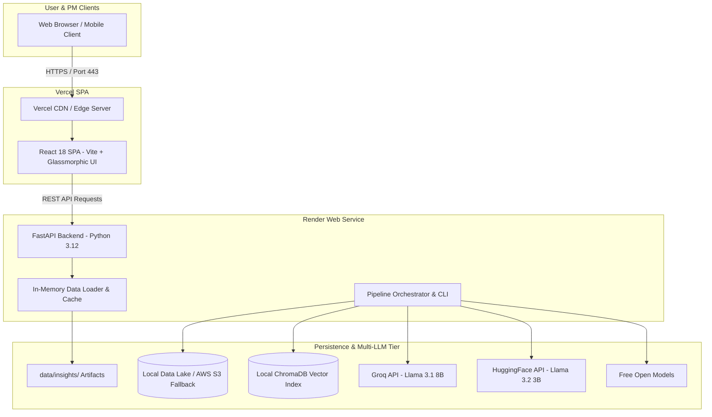

# Production Deployment Guide: Blinkit AI Discovery Engine

This document provides a comprehensive, step-by-step guide for deploying, configuring, securing, and maintaining the **Blinkit AI Discovery Engine**. It aligns directly with the architectural specifications in [context.md](file:///c:/Nextleap%20Projects%20Git/ProductManagerFellowshipGraduationProject/docs/context.md), [architecture.md](file:///c:/Nextleap%20Projects%20Git/ProductManagerFellowshipGraduationProject/docs/architecture.md), and [implementation-plan.md](file:///c:/Nextleap%20Projects%20Git/ProductManagerFellowshipGraduationProject/docs/implementation-plan.md).

---

## 1. Executive Overview & Deployment Topology

The system uses a decoupled dual-tier cloud architecture designed for high availability, low-latency API response times ($<2\text{s}$), and reproducible multi-agent analytics.



---

## 2. Environment Variables & Credentials Matrix

Before deploying, ensure all required environment variables are set in your deployment environments (Render for backend, Vercel for frontend).

### 2.1 Backend Environment Variables

| Variable Name | Required | Default Value | Description |
|---|---|---|---|
| `LLM_PROVIDER` | Yes | `groq` | Primary LLM engine provider |
| `LLM_API_KEY` | Yes | — | Groq API Key for theme & insight synthesis |
| `LLM_MODEL` | Yes | `llama-3.1-8b-instant` | Groq LLM model name |
| `GROQ_API_KEY` | Optional | — | Explicit Groq API Key fallback |
| `GROQ_MODEL` | Optional | `llama-3.1-8b-instant` | Model for Agent extractions |
| `HF_TOKEN` | Yes | — | Hugging Face token for Multi-LLM Consensus Model 2 |
| `HF_MODEL` | Optional | `meta-llama/Llama-3.2-3B-Instruct` | Model for Consensus verification |
| `EMBEDDING_MODEL` | Optional | `sentence-transformers/all-MiniLM-L6-v2` | Sentence Transformer embedding model |
| `AWS_S3_BUCKET` | Optional | `blinkit-discovery-engine-raw` | AWS S3 raw ingestion payload backup bucket |
| `VECTOR_DB_PROVIDER` | Optional | `chroma` | Vector database engine |
| `CHROMA_PERSIST_DIR` | Optional | `data/vectorstore` | Local vector index persistence directory |
| `REDDIT_CLIENT_ID` | Optional | — | Reddit API Client ID for scraper |
| `REDDIT_CLIENT_SECRET` | Optional | — | Reddit API Client Secret |
| `REDDIT_USER_AGENT` | Optional | `blinkit-discovery-engine/1.0` | Custom User-Agent string for Reddit scraper |
| `RAW_DATA_DIR` | Optional | `data/raw` | Raw JSONL storage directory |
| `PROCESSED_DATA_DIR` | Optional | `data/processed` | Processed Parquet data directory |
| `INSIGHTS_DIR` | Optional | `data/insights` | Generated insight JSON store |
| `PORT` | Yes | `8000` | Port exposed by Uvicorn server |

### 2.2 Frontend Environment Variables

| Variable Name | Required | Example Value | Description |
|---|---|---|---|
| `VITE_API_URL` | Yes | `https://<your-backend-app>.onrender.com/api/v1` | Public backend REST API base URL |

---

## 3. Backend Deployment

### Option A: Render Deployment (Recommended)

1. **Create Render Web Service**:
   * Log into [Render.com](https://render.com).
   * Click **New +** $\rightarrow$ **Web Service** $\rightarrow$ Connect GitHub repository `ProductManagerFellowshipGraduationProject`.
   * Alternatively, use Render's Blueprint feature via the included [render.yaml](file:///c:/Nextleap%20Projects%20Git/ProductManagerFellowshipGraduationProject/render.yaml).

2. **Configure Settings**:
   * **Name**: `blinkit-discovery-backend`
   * **Environment**: `Python 3` (or Docker)
   * **Region**: Singapore (or nearest region)
   * **Build Command**: `pip install --upgrade pip && pip install -r requirements.txt`
   * **Start Command**: `uvicorn src.app.api_server:app --host 0.0.0.0 --port $PORT`

3. **Configure Environment Variables**:
   * Under **Environment Variables**, add:
     - `LLM_PROVIDER` = `groq`
     - `LLM_API_KEY` = `your_groq_api_key`
     - `LLM_MODEL` = `llama-3.1-8b-instant`
     - `GROQ_API_KEY` = `your_groq_api_key`
     - `GROQ_MODEL` = `llama-3.1-8b-instant`

4. **Verify Health Endpoint**:
   ```powershell
   curl https://<your-render-app>.onrender.com/api/v1/health
   # Expected Output: {"status":"healthy","timestamp":"...","version":"1.0.0"}
   ```

---

### Option B: Containerized Docker Deployment (Self-Hosted / Cloud VM)

1. **Build Docker Image**:
   ```powershell
   docker build -t blinkit-discovery-engine:latest .
   ```

2. **Run Container with Volume Mounting**:
   ```powershell
   docker run -d \
     --name blinkit-backend \
     -p 8000:8000 \
     -e LLM_PROVIDER="groq" \
     -e LLM_API_KEY="your_groq_api_key" \
     -e LLM_MODEL="llama-3.1-8b-instant" \
     -v ${PWD}/data:/app/data \
     blinkit-discovery-engine:latest
   ```

3. **Verify Local Container**:
   ```powershell
   curl http://localhost:8000/api/v1/health
   ```

---

## 4. Frontend Deployment (Vercel)

1. **Import Repository to Vercel**:
   * Log into [Vercel.com](https://vercel.com).
   * Click **Add New** $\rightarrow$ **Project** $\rightarrow$ Import from GitHub.

2. **Configure Project Settings**:
   * **Framework Preset**: Vite
   * **Root Directory**: `frontend`
   * **Build Command**: `npm run build`
   * **Output Directory**: `dist`

3. **Environment Variable Configuration**:
   * In Vercel Project Settings $\rightarrow$ **Environment Variables**:
     ```ini
     VITE_API_URL=https://<your-backend-app>.onrender.com/api/v1
     ```

4. **Deploy**:
   * Click **Deploy**. Vercel will build assets and issue a live URL (e.g., `https://blinkit-discovery-engine.vercel.app`).

5. **SPA Route Handling Verification**:
   * The `frontend/vercel.json` rewrite file ensures deep links work cleanly on browser refresh:
     ```json
     {
       "rewrites": [
         { "source": "/(.*)", "destination": "/index.html" }
       ]
     }
     ```

---

## 5. Data Artifacts & Persistence Strategy

To deliver Instant Dashboard Loads ($<2\text{s}$ response time) without re-running expensive LLM pipelines on every request, pre-computed JSON and Parquet artifacts are bundled into the deployment container or stored on disk.

```
data/
├── raw/                        # Consolidated raw scraped reviews (157,630 raw records)
├── processed/                  # Cleaned Parquet & Vector metadata
│   ├── all_normalized_reviews.json
│   └── processed_records.parquet
└── insights/                   # Validated Multi-Agent Output Artifacts
    ├── agent_theme_output.json
    ├── agent_emotion_output.json
    ├── agent_habit_output.json
    ├── agent_jtbd_output.json
    ├── agent_segment_output.json
    ├── agent_contradiction_output.json
    ├── behavior_graph.json
    ├── multi_llm_consensus_report.json
    └── insights_final.json
```

### Refreshing Production Insights
To trigger a live refresh of the discovery pipeline and update all cached artifacts in production:
```powershell
curl -X POST https://<your-backend-app>.onrender.com/api/v1/pipeline/run
```

---

## 6. Security, CORS & Compliance Hardening

1. **CORS Lock**:
   In [src/app/api_server.py](file:///c:/Nextleap%20Projects%20Git/ProductManagerFellowshipGraduationProject/src/app/api_server.py), ensure `CORSMiddleware` restricts access to your production Vercel frontend:
   ```python
   app.add_middleware(
       CORSMiddleware,
       allow_origins=[
           "http://localhost:3000",
           "http://localhost:5173",
           "https://<your-dashboard>.vercel.app"
       ],
       allow_credentials=True,
       allow_methods=["*"],
       allow_headers=["*"],
   )
   ```

2. **API Credentials & PII Protection**:
   * Verify `.env` is included in `.gitignore`.
   * Ensure scrapers anonymize author names and strip PII before storing.

3. **Rate Limiting & Ethics**:
   * Web scrapers implement exponential backoff on HTTP 429 and respect platform Terms of Service.

---

## 7. Post-Deployment Verification & Smoke Test Matrix

Run the following smoke tests against the live production deployment to confirm system health across all components:

### 7.1 Backend API Verification Checklist

```powershell
# 1. Health check
curl -s https://<your-backend>.onrender.com/api/v1/health | grep '"status":"healthy"'

# 2. Insights Endpoint (With Q1 Research Question Filter)
curl -s "https://<your-backend>.onrender.com/api/v1/insights?research_question=Q1"

# 3. Behavior Graph Engine
curl -s https://<your-backend>.onrender.com/api/v1/behavior-graph

# 4. Consumer Archetypes
curl -s https://<your-backend>.onrender.com/api/v1/archetypes

# 5. Multi-LLM Consensus Report
curl -s https://<your-backend>.onrender.com/api/v1/validation/report

# 6. Analytics Summary
curl -s https://<your-backend>.onrender.com/api/v1/analytics/summary
```

### 7.2 Frontend UX Verification Checklist

- [ ] Open Vercel live URL in browser; verify hero metrics render without loading loops.
- [ ] Test Research Question nav bar (Q1–Q8) to confirm insight cards filter dynamically.
- [ ] Expand an Insight Card to verify evidence grounding, representative quotes, and multi-source counts.
- [ ] Open the Multi-LLM Consensus modal; verify pass rates across Groq, HuggingFace, and Open Models display correctly.
- [ ] Check developer tools console; verify zero CORS or 404 network errors.

---

## 8. Continuous Integration & Deployment (CI/CD)

Below is the GitHub Actions workflow definition (`.github/workflows/deploy.yml`) for automated testing and deployment verification:

```yaml
name: CI/CD Pipeline

on:
  push:
    branches: [ main ]
  pull_request:
    branches: [ main ]

jobs:
  test:
    runs-on: ubuntu-latest

    steps:
    - uses: actions/checkout@v3

    - name: Set up Python 3.12
      uses: actions/setup-python@v4
      with:
        python-version: '3.12'

    - name: Install dependencies
      run: |
        python -m pip install --upgrade pip
        pip install -r requirements.txt

    - name: Run Pytest Suite
      env:
        LLM_PROVIDER: groq
        LLM_API_KEY: ${{ secrets.GROQ_API_KEY }}
      run: |
        pytest tests/ -v

    - name: Test Docker Container Build
      run: |
        docker build -t blinkit-discovery-engine:ci .
```

---

## 9. Operations Runbook & Troubleshooting

| Symptom / Error | Root Cause | Remediation Action |
|---|---|---|
| **CORS policy error in browser console** | Disallowed origin header | Update `allow_origins` in `api_server.py` with production Vercel domain. |
| **HTTP 429 Rate Limit from Groq API** | LLM API rate limit exceeded | Pipeline falls back to exponential backoff or heuristic classifier stubs. |
| **500 Internal Server Error on `/insights`** | Missing or corrupted `insights_final.json` | Run `python scripts/analyze_only.py` to regenerate insight artifacts in `data/insights/`. |
| **Render Web Service Cold Start (~30s)** | Free tier instance spun down after 15m inactivity | Frontend displays shimmer loading animation with a retry prompt. |
| **Frontend displays empty data** | `VITE_API_URL` pointing to wrong endpoint | Update Vercel environment variable to `https://<your-app>.onrender.com/api/v1` and redeploy. |

---

*Updated for NextLeap Product Manager Fellowship — Graduation Project*
