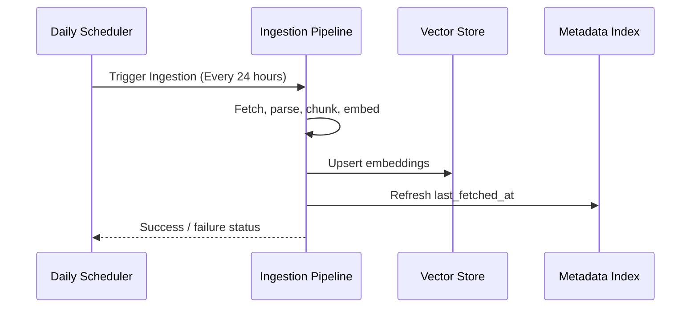
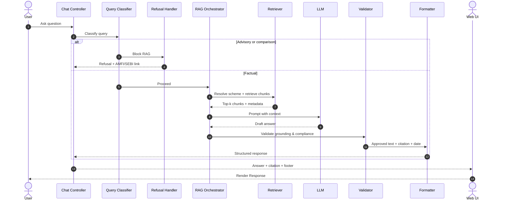

# Architecture: Mutual Fund FAQ Assistant

This document describes the system architecture for a facts-only, RAG-based FAQ assistant scoped to the ICICI Prudential Mutual Fund scheme pages on Groww. It is derived from [problemStatement.md](file:///c:/Nextleap%20Projects%20Git/RAGMF/docs/problemstatement.txt).

---

## 1. Design Goals

| Goal | Architectural Implication |
|---|---|
| **Facts-only answers** | Retrieval grounded in corpus; LLM constrained by system prompt and post-generation validation |
| **Source-backed responses** | Every answer carries exactly one citation URL from the active corpus |
| **Compliance** | Advisory/comparison queries are classified and refused before or instead of retrieval |
| **Accuracy over intelligence** | Prefer retrieved text over model inference; restricted corpus (110 URLs) reduces hallucination risk |
| **Transparency** | Fixed response format: ≤3 sentences + citation(s) + Last updated from sources: \<date\> footer |
| **Privacy** | Stateless chat; no PII collection or persistence |

---

## 2. High-Level Architecture

```mermaid
graph TD
    %% Presentation Layer
    User[Web UI: Chat + Disclaimer] -->|POST /api/chat| ChatController[API Gateway / Chat Controller]
    
    %% Application Layer
    subgraph Application Layer
        ChatController --> QueryClassifier{Query Classifier}
        QueryClassifier -->|Advisory / Comparison| Refusal[Refusal Handler]
        QueryClassifier -->|Factual| Orchestrator[RAG Orchestrator]
        Orchestrator --> Formatter[Response Formatter]
        Formatter --> Validator[Output Validator]
    end

    %% Retrieval Layer
    subgraph Retrieval Layer
        Orchestrator --> Retriever[Retriever]
        Retriever --> VectorStore[(Vector Store)]
        Retriever --> MetadataIndex[Scheme Metadata Index]
    end

    %% Generation Layer
    subgraph Generation Layer
        Orchestrator --> LLM[LLM API]
    end

    %% Offline Ingestion Pipeline
    subgraph Ingestion Pipeline (Offline)
        Scheduler[Daily Scheduler] --> Crawler[Ingestion & Crawler]
        Crawler --> Parser[Cleaner / Section Parser]
        Parser --> Chunker[Chunker]
        Chunker --> Embedding[Embedding Service]
        Embedding --> IndexBuilder[Index Builder]
        IndexBuilder --> VectorStore
        IndexBuilder --> MetadataIndex
    end
```

* **Request path (online):** User question → classify → retrieve relevant chunks → generate grounded answer → validate → format → display.
* **Index path (offline):** A daily scheduler triggers the ingestion pipeline → fetch all 110 Groww pages → parse into structured sections → chunk → embed → persist to vector store and metadata index.

---

## 3. System Components

### 3.1 Presentation Layer (Vite + React TypeScript UI)
A premium, responsive single-page chat dashboard built inside the `frontend/` directory using React, TypeScript, Vite, and Tailwind CSS.
* **Responsibilities:**
  * Display welcoming introductory guidelines and warnings disclaimer banner: `“Facts-only. No investment advice.”`
  * Show three clickable FAQ question chips that auto-dispatch query prompts on click.
  * Accept free-text queries in a styled text input.
  * Render assistant replies inside message cards complete with Groww source citation links (external link icon) and `Last updated from sources: <date>` metadata footers.
  * Prevent PII submission by scrubbing Aadhaar, PAN, emails, and phone patterns (redundantly sanitized at both UI input limits and backend scrubber levels).
  * Expose a **Select Schemes** Modal checklist populated dynamically from `/api/funds`. Toggled active selections are sent directly to the backend `/api/chat` endpoint inside the `selected_funds` payload. For single fund selections, the UI may also suffix query context (e.g. *“What is the NAV?”* -> *“What is the NAV? on ICICI Prudential Commodities Fund”*) for additional clarification.
* **Suggested example questions:**
  1. *What is the expense ratio of ICICI Prudential Large Cap Fund?*
  2. *What is the exit load on ICICI Prudential Commodities Fund?*
  3. *Who manages ICICI Prudential Technology Direct Plan-Growth?*


### 3.2 Application Layer

#### Chat Controller
* Exposes a single endpoint, e.g., `POST /api/chat`
* Accepts `{ "message": string, "selected_funds": list[str] }` — stateless chat payload with optional selected fund slugs for scoped retrieval
* Routes to classifier, then RAG or refusal path
* Returns structured JSON for the UI to render:
  ```json
  {
    "answer": "The expense ratio of ICICI Prudential Large Cap Fund is 0.92%.",
    "citation_url": "https://groww.in/mutual-funds/icici-prudential-large-cap-fund-direct-growth", // Comma-separated if multiple sources
    "last_updated": "2026-05-29", // Comma-separated if multiple dates
    "is_refusal": false,
    "disclaimer": "Facts-only. No investment advice."
  }
  ```

#### Query Classifier
Runs before retrieval to enforce compliance.

| Class | Examples | Action |
|---|---|---|
| **Factual** | Expense ratio, exit load, min SIP, benchmark, fund manager name/tenure/experience | Proceed to RAG |
| **Advisory** | "Should I invest?", "Is this a good fund?" | Refusal handler |
| **Comparison** | "Which fund is better?", "Mid cap vs large cap?" | Refusal handler |
| **Performance-seeking** | "What returns will I get?", "Compare 3Y returns" | Refusal or link-only response to scheme page |
| **Out of scope** | Schemes not in corpus, unrelated topics | Polite refusal with scope explanation |

* **Implementation options (in order of simplicity):**
  1. Rule-based keyword/pattern matcher for advisory and comparison phrases
  2. Lightweight LLM classification with a fixed label set
  3. Hybrid: rules first, LLM fallback for ambiguous cases

#### Refusal Handler
Produces a polite, templated response when classification blocks RAG:
* States the facts-only limitation
* Does not retrieve or invent fund data
* Includes one educational link (AMFI or SEBI), e.g.:
  * [AMFI — Mutual Funds](https://www.amfiindia.com/)
  * [SEBI — Investor Education](https://investor.sebi.gov.in/)

#### RAG Orchestrator
Coordinates retrieval, prompt assembly, generation, and validation for factual queries.

#### Response Formatter
Enforces output contract:
* Maximum 3 sentences in the answer body
* Comma-separated `citation_url` list containing the source URLs of all referenced schemes (must match the allowed corpus URLs)
* Footer: `Last updated from sources: <date>` where `<date>` comes from chunk metadata (page fetch or parse timestamp), not model inference.

### 3.3 Retrieval Layer

#### Corpus (Active)
The assistant is scoped to the **110 ICICI Prudential Mutual Fund schemes on Groww** listed in [icici_funds_list.md](file:///c:/Nextleap%20Projects%20Git/RAGMF/docs/icici_funds_list.md). The offline pipeline crawls and indexes all the schemes in this manifest. Due to URL/scheme aliasing on Groww, these 110 URLs consolidate into **104 unique schemes** inside the database index.

Some key examples in the corpus:

| Scheme | Source URL |
|---|---|
| ICICI Prudential Large Cap Fund | https://groww.in/mutual-funds/icici-prudential-large-cap-fund-direct-growth |
| ICICI Prudential Commodities Fund | https://groww.in/mutual-funds/icici-prudential-commodities-fund-direct-growth |
| ICICI Prudential Technology Direct Plan-Growth | https://groww.in/mutual-funds/icici-prudential-technology-fund-direct-growth |

#### Scheme Metadata Index
A small lookup table (JSON or embedded DB) keyed by scheme name / slug:
```json
{
  "slug": "icici-prudential-large-cap-fund-direct-growth",
  "scheme_name": "ICICI Prudential Large Cap Fund",
  "category": "Equity — Large Cap",
  "source_url": "https://groww.in/mutual-funds/icici-prudential-large-cap-fund-direct-growth",
  "last_fetched_at": "2026-05-29"
}
```
Used to:
* Resolve which scheme the user is asking about
* Pre-filter retrieval to a single scheme when detected
* Attach the correct citation URL

#### Vector Store
Stores embedded text chunks with rich metadata:

| Metadata field | Purpose |
|---|---|
| `source_url` | Citation link |
| `scheme_name` | Scheme disambiguation |
| `section` | e.g. expense_ratio, exit_load, fund_management, benchmark |
| `last_updated` | Footer date |
| `chunk_text` | Raw passage for grounding |

* **Recommended stores for a lightweight build:** Chroma, FAISS, or LanceDB (local, file-backed).

#### Retriever
Two-stage retrieval for better precision on a small corpus:
1. **Scheme resolution** — If `selected_funds` are provided, query ChromaDB for each selected fund individually. Otherwise, fuzzy match the user query to a scheme via slug, name, or alias (e.g. "large cap", "commodities fund").
2. **Semantic search** — Query ChromaDB with metadata filters applied on `slug` to restrict vector matching only to the target fund(s).
* Because the corpus is small (110 schemes), querying per selected fund ensures high-quality grounding context is retrieved for every selected scheme without cross-contamination.

### 3.4 Generation Layer

#### LLM (Constrained Generation)
The model receives:
* System prompt: facts-only, no advice, use only provided context, max 3 sentences
* Retrieved chunks with source URLs and dates
* User question

Hard rules in the prompt:
1. Answer only from retrieved context; if context is insufficient, say so and point to the scheme page
2. Do not compare funds or compute returns
3. Do not recommend buy/sell/hold
4. Include no more than one URL in the answer (formatter may extract citation separately)

#### Output Validator
Post-generation checks before returning to the user:

| Check | Failure action |
|---|---|
| Answer ≤ 3 sentences | Truncate or regenerate |
| Citation URL in allowlist | Replace with best matching corpus URL from retrieved chunks |
| No advisory language detected | Route to refusal template |
| Grounding: key facts appear in retrieved chunks | Regenerate or fallback to link-only response |
| No speculative return projections or subjective comparisons | Strip or route to refusal handler |

### 3.5 Offline Ingestion Pipeline
Triggered once per day by the scheduler (see §3.6), or on manual CLI trigger — never on every user query.

```
Daily Scheduler ──> Fetch 110 Groww URLs ──> Parse HTML/Markdown ──> Extract Sections ──> Chunk Text ──> Generate Embeddings ──> Upsert Vector Store / Update Metadata Index
```

#### Ingestion steps:
1. **Fetch** — HTTP GET each corpus URL; store raw HTML or converted markdown with fetch timestamp.
2. **Clean & parse** — Remove navigation, footers, and duplicate chrome; retain scheme-specific sections. *Note: Slugs are sanitized to replace colons (`:`) with hyphens (`-`) to ensure Windows compatibility and prevent path truncation/alternate data stream issues when writing raw or processed cache files.*
3. **Section extraction** — Map content into logical blocks aligned with FAQ query types:

| Section tag | Example content |
|---|---|
| `identity` | Scheme name, AMC (fund house), scheme code/ISIN, category/sub-category, plan type, option, launch date |
| `performance_pricing` | NAV (current + historical), returns (1M, 3M, 6M, 1Y, 3Y, 5Y, since inception, CAGR), rolling returns, benchmark comparisons |
| `expense_ratio` | Expense ratio value and definition (Direct vs Regular) |
| `exit_load` | Exit load structure, period, and entry load (mostly 0) |
| `minimum_investment` | Min SIP/lumpsum amounts and available SIP dates |
| `benchmark` | Benchmark index name and performance comparisons |
| `tax` | STCG/LTCG implications (factual only) |
| `fund_management` | Manager names, tenure, education, experience, other schemes |
| `risk_metrics` | SD, Sharpe ratio, Sortino ratio, Beta, Alpha, Riskometer level |
| `portfolio_composition` | AUM (historical too), top holdings list & %, sector allocation %, market cap split, credit rating breakup, average maturity, YTM |
| `investment_objective` | Stated objective and fund strategy |
| `fund_house` | AMC name, website, incorporation date |

4. **Chunking** — Section-aware chunks (~200–400 tokens) with overlap only within the same section; keep fund manager bios intact in `fund_management` chunks.
5. **Embed** — Use a consistent embedding model (e.g. `text-embedding-3-small`, `nomic-embed-text`, or equivalent open-source model).
6. **Index** — Upsert into vector store; refresh `last_fetched_at` in metadata index. *Note: Chunks are deduplicated by ID prior to indexing to prevent unique constraint failures when different URL paths resolve to the same underlying scheme details.*

### 3.6 Daily Ingestion Scheduler
A dedicated scheduler component runs the full ingestion pipeline on a fixed daily cadence so the vector store and metadata index stay aligned with the latest Groww scheme pages.
* **Responsibilities:**
  * Trigger ingestion at a configured time each day (e.g. 02:00 UTC / off-peak hours)
  * Invoke the ingestion entrypoint (ingestion/run.py or equivalent) as a single atomic job
  * Log start time, completion status, URLs fetched, and chunk count
  * On failure, record error details and optionally retry once before alerting
* **Implementation options:**

| Option | Use case |
|---|---|
| **Cron** (Linux/macOS crontab or container cron) | Simple VM / bare-metal deployment |
| **APScheduler** (embedded in a worker process) | Single-process Python deployment |
| **GitHub Actions** scheduled workflow | Repo-hosted corpus refresh with no dedicated worker |
| **Cloud scheduler** (AWS EventBridge, GCP Cloud Scheduler) | Managed production environments |

* **Scheduler flow:**


*The online chat API is not blocked during ingestion; retrieval continues to serve the previous index until the new index is fully written and swapped in.*

---

## 4. End-to-End Request Flow



---

## 5. Data Model

### Chunk record (vector store document)
```json
{
  "id": "icici-prudential-technology-fund-direct-growth#fund_management#0",
  "text": "Anish Tawakley — Fund Manager, Sep 2018 - Present.\nEducation: B.Tech (IIT), PGDM (IIM). Experience: Prior to ICICI AMC...",
  "scheme_name": "ICICI Prudential Technology Direct Plan-Growth",
  "source_url": "https://groww.in/mutual-funds/icici-prudential-technology-fund-direct-growth",
  "section": "fund_management",
  "last_updated": "2026-05-29",
  "embedding": [ 0.012, -0.004, "..." ]
}
```

### Chat request / response (API contract)

#### Request:
```json
{
  "message": "Who manages ICICI Prudential Technology Fund?",
  "selected_funds": []
}
```
Or for multi-fund filtering:
```json
{
  "message": "nnav of both",
  "selected_funds": [
    "icici-prudential-gold-etf-fof-direct-growth",
    "icici-prudential-silver-etf-fof-direct-growth"
  ]
}
```

#### Response (factual):
```json
{
  "answer": "ICICI Prudential Technology Direct Plan-Growth is managed by Anish Tawakley (since Sep 2018) and Vaibhav Dusad (since Jan 2021). Detailed manager experience and profiles are available on the scheme page.",
  "citation_url": "https://groww.in/mutual-funds/icici-prudential-technology-fund-direct-growth", // Comma-separated if multiple sources
  "last_updated": "2026-05-29", // Comma-separated if multiple dates
  "is_refusal": false,
  "disclaimer": "Facts-only. No investment advice."
}
```

#### Response (refusal):
```json
{
  "answer": "I can only answer factual questions about ICICI Prudential schemes in my corpus, such as expense ratio, exit load, or fund manager details. I cannot provide investment advice or recommend which fund to choose.",
  "citation_url": "https://www.amfiindia.com/investor/knowledge-center-info?faqs",
  "last_updated": "2026-05-29",
  "is_refusal": true,
  "disclaimer": "Facts-only. No investment advice."
}
```

---

## 6. Query Routing Matrix

| User intent | Classifier label | Retrieval | Generation behavior |
|---|---|---|---|
| **Expense ratio of a named scheme** | Factual | Filter by scheme → `expense_ratio` section | State ratio from chunk |
| **Exit load** | Factual | `exit_load` section | State load rules |
| **Minimum SIP / Investment details** | Factual | `minimum_investment` section | State amounts and SIP dates |
| **Benchmark details** | Factual | `benchmark` section | State index name and benchmark returns |
| **Fund manager / tenure / experience** | Factual | `fund_management` section | List managers and bios factually |
| **Fund Identity / ISIN / Launch date** | Factual | `identity` section | Provide scheme details, plan type, launch date |
| **Historical returns / NAV pricing** | Factual | `performance_pricing` section | State historical NAV, returns (1M, 1Y, 5Y, CAGR) |
| **Risk metrics (Sharpe, Beta, Alpha, Riskometer)** | Factual | `risk_metrics` section | List SD, Sharpe, Beta, and Riskometer level |
| **Portfolio holdings / Sector split / AUM** | Factual | `portfolio_composition` section | State AUM, top holdings, sector allocation % |
| **Should I invest?** | Advisory | None | Refusal + AMFI/SEBI link |
| **Which fund is better?** | Comparison | None | Refusal + educational link |
| **Expected returns / Speculative comparison** | Performance | None | Refuse calculations; provide scheme page URL only |
| **Unknown scheme (not in corpus)** | Out of scope | None | Explain limited corpus; list supported schemes |

## 7. Technology Stack (Recommended)

| Layer | Options | Rationale |
|---|---|---|
| **Frontend** | React (Vite) | Minimal chat UI, fast to ship, rich and responsive styling |
| **Backend** | Python (FastAPI) | Strong RAG ecosystem in Python, fast async execution |
| **Embeddings** | BGE-small-en-v1.5 (local, sentence-transformers) or OpenAI | Free or standard model; sufficient for 110-scheme corpus |
| **Vector DB** | ChromaDB (local persistent) | Metadata filtering, ease of setup, file-backed storage |
| **LLM** | Gemini 1.5 Flash or Groq (llama-3.3-70b) | High accuracy, strict constraint compliance, fast responses |
| **Ingestion** | BeautifulSoup / requests | Lightweight scraping and parsing of Groww scheme pages |
| **Scheduler** | APScheduler (embedded) or GitHub Actions / Cron | Trigger the ingestion pipeline daily to keep database updated |
| **Config** | Environment variables & YAML config | API keys, corpus URLs, and scheduling times, no secrets in repo |

---

## 8. Security, Privacy & Compliance

| Blocked / Not Stored | Allowed | Reject input patterns |
|---|---|---|
| PAN, Aadhaar, account #, OTP | Anonymous factual questions | PAN, Aadhaar |
| Email, phone | Corpus URLs only | Email, phone |
| Investment advice generation | Refusal | - |

* **Stateless API** — No user accounts, chat history persistence, or analytics tied to identity (optional ephemeral in-memory UI history is acceptable)
* **Input sanitization** — Reject or strip patterns resembling PII before LLM call
* **Allowlist citations** — Validator ensures answer citations are corpus URLs (or fixed AMFI/SEBI URLs for refusals)
* **No training on user data** — Queries are not used to fine-tune models in this phase
* **Rate limiting** — Basic per-IP limits to prevent abuse and cost overrun

---

## 9. Deployment Topology

### Development (local):
```
[Browser] ──> [FastAPI :8000] ──> [Chroma (local disk)] ──> [LLM API]
                    ▲
                    │
            [Daily Scheduler] ──> [Ingestion script (CLI)]
```

### Production (minimal):
```
[Browser] ──> [Static UI (CDN/Vercel)] ──> [API (container/VM)] ──> [Vector DB volume]
                                                    │
                                                    └──> [LLM provider]
```
```
[Daily Scheduler (cron / cloud scheduler / GitHub Actions)]
                         │
                         ▼
        [Ingestion worker] ──> rebuild index ──> Vector DB volume
```

* **Corpus refresh:** A scheduler triggers the ingestion pipeline once daily, rebuilding the vector store and metadata index from live Groww URLs. Manual re-run remains available via CLI for ad-hoc refreshes outside the schedule.
* **Environment separation:** Dev uses cached markdown snapshots; prod refreshes from live Groww URLs.

---

## 10. Non-Functional Requirements

| Attribute | Target |
|---|---|
| **Latency (p95)** | < 5 s end-to-end (including LLM) |
| **Availability** | Best-effort for demo; no SLA in phase 1 |
| **Corpus size** | 110 URLs; ~500–1500 chunks total |
| **Ingestion cadence** | Daily scheduler trigger (automatic corpus refresh) |
| **Answer length** | ≤ 3 sentences + 1 link + footer |
| **Observability** | Log query class, scheme resolved, retrieval scores, refusal rate (no PII) |

---

## 11. Known Limitations
* **Corpus scope** — Only ICICI Prudential schemes on Groww; no AMFI/SEBI document ingestion in this phase
* **Source freshness** — Answers reflect the last successful daily ingestion run; intra-day Groww updates are picked up on the next scheduled run
* **Third-party source** — Groww is used as reference context, not ICICI Prudential AMC primary documents (KIM/SID/factsheets)
* **No speculative projections** — Speculative performance return projections are explicitly out of scope
* **Scheme disambiguation** — Ambiguous queries (e.g. "ICICI fund expense ratio" without naming the scheme) may require clarification or return the most similar scheme
* **Fund management completeness** — Manager data is limited to what appears on each Groww scheme page
* **Document download guides** — Not in current corpus unless added to a future URL list

---

## 12. Future Extensions (Out of Current Scope)
* Expand corpus to 15–25 official AMC / AMFI / SEBI URLs
* Add clarification turn: "Which scheme did you mean?"
* Structured extraction cache (JSON facts per scheme) for numeric fields like expense ratio
* Multilingual support (Hindi)
* Admin dashboard for ingestion status and chunk inspection

---

## 13. Project Structure (Actual)

```
RAGMF/
├── docs/
│   ├── problemstatement.txt
│   ├── context.md
│   ├── architecture.md          # this document
│   ├── icici_funds_list.md
│   └── implementation_plan.md
├── data/
│   ├── raw/                     # fetched HTML/markdown per URL
│   ├── processed/               # parsed sections & chunks
│   └── index/                   # vector store files & metadata index
├── src/
│   └── app/
│       ├── config.py            # configuration logic
│       ├── api_server.py        # FastAPI entrypoint
│       ├── ingestion/
│       │   ├── scraper.py
│       │   ├── parser.py
│       │   ├── chunk.py
│       │   ├── index.py
│       │   └── run.py
│       └── services/
│           ├── classifier.py
│           ├── generator.py
│           ├── pii_scrubber.py
│           ├── refusal_handler.py
│           ├── response_validator.py
│           └── retriever.py
├── config/
│   └── corpus.yaml              # 110 URLs + scheme metadata configuration
├── tests/
│   ├── test_api_server.py
│   ├── test_chunk.py
│   ├── test_classifier.py
│   ├── test_config.py
│   ├── test_generator.py
│   ├── test_index.py
│   ├── test_ingestion.py
│   ├── test_pii_scrubber.py
│   ├── test_refusal_handler.py
│   ├── test_response_validator.py
│   └── test_retriever.py
├── requirements.txt
└── README.md
```

---

## 14. Summary
The Mutual Fund FAQ Assistant is a compliance-first RAG system. A query classifier gates advisory and comparison questions before retrieval. Factual questions flow through scheme-aware retrieval over 110 indexed Groww pages, grounded LLM generation, and a strict response formatter that enforces brevity, a single citation, and a last-updated footer. A daily scheduler triggers the offline ingestion pipeline to keep embeddings and metadata in sync with the defined corpus. The architecture prioritizes verifiability and refusal correctness over open-ended conversational ability.
