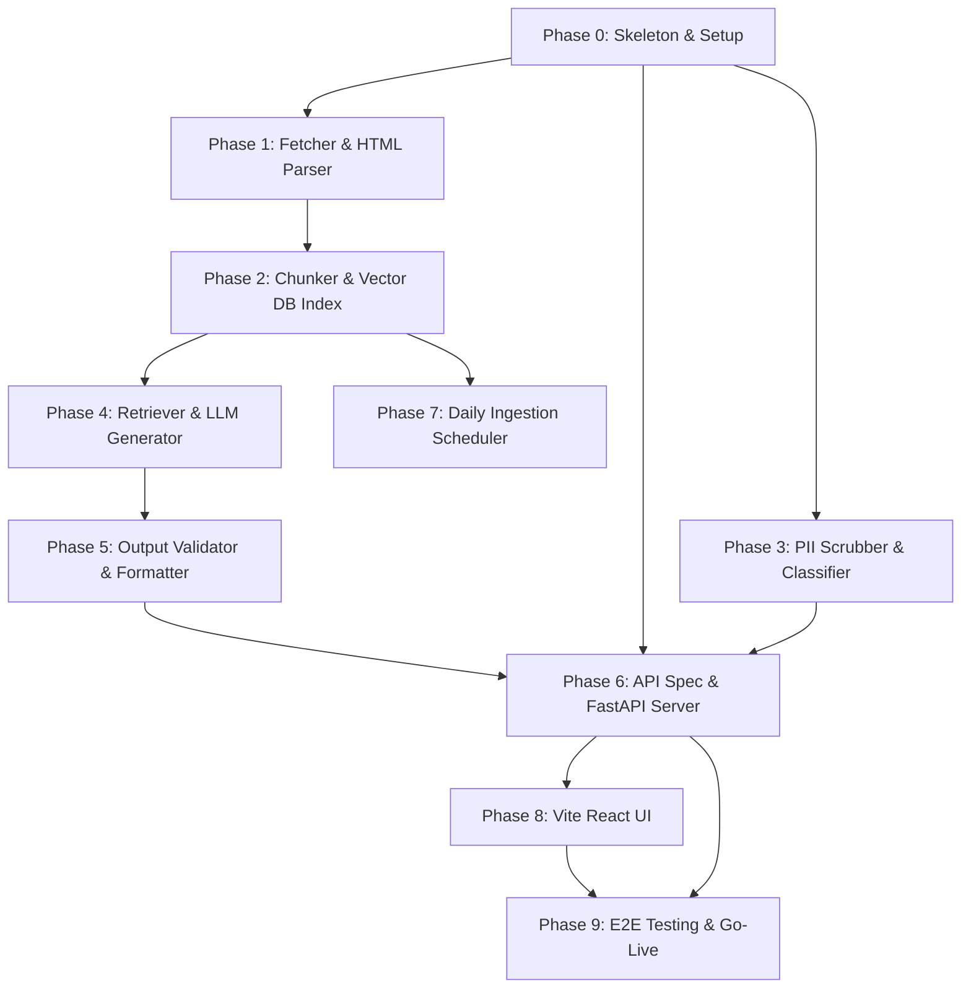

# Detailed Implementation Plan — Mutual Fund FAQ Assistant (RAGMF)

This document outlines the detailed, phase-wise implementation plan for the RAG-based facts-only Mutual Fund FAQ Assistant.

---

## 1. Requirements Traceability

The table below maps the functional, non-functional, and compliance requirements from the [Project Context](file:///c:/Nextleap%20Projects%20Git/RAGMF/docs/context.md) and [Architecture Specification](file:///c:/Nextleap%20Projects%20Git/RAGMF/docs/architecture.md) to specific implementation deliverables:

| Req ID | Requirement Description | Component / Phase | Verification Method |
|---|---|---|---|
| **REQ-01** | Ingest data from 110 ICICI Prudential scheme URLs on Groww | Phase 1 (Ingestion & Fetch) | Check raw HTML snapshot files |
| **REQ-02** | Clean HTML, parse structured sections, and tag attributes | Phase 1 (HTML Parser) | Parsed section JSON assertions |
| **REQ-03** | Chunk text (section-aware, keep manager bios intact) | Phase 2 (Chunker) | Chunk text size and boundary checks |
| **REQ-04** | Embed chunks (BGE or OpenAI) & store in Chroma/FAISS | Phase 2 (Vector Database) | Retrieval accuracy / cosine similarity tests |
| **REQ-05** | Sanitize inputs: mask/redact PAN, Aadhaar, OTPs, phone, email | Phase 3 (PII Scrubber) | Test string matching with mock PII patterns |
| **REQ-06** | Classify query intent: Factual vs. Advisory/Comparison/Out-of-Scope | Phase 3 (Query Classifier) | Intent accuracy check on 50 sample questions |
| **REQ-07** | Generate polite refusal with SEBI / AMFI links for advisory intents | Phase 3 (Refusal Handler) | Assert refusal output and link correctness |
| **REQ-08** | Two-stage retrieval: scheme matching + metadata semantic filter | Phase 4 (Retriever) | Top-k chunks metadata verification |
| **REQ-09** | Constrain LLM generation: answer only from context, no advice | Phase 4 (LLM Generator) | Grounding tests, check for advice leakage |
| **REQ-10** | Validate constraints: ≤3 sentences, citation(s) allowed, append footer | Phase 5 (Output Validator) | Sentence split tests, footer timestamp check |
| **REQ-11** | Expose REST endpoints: stateless POST `/api/chat` JSON API | Phase 6 (FastAPI App) | HTTP POST integration test assertions |
| **REQ-12** | Automatic daily ingestion run (refresh corpus index offline) | Phase 7 (Daily Scheduler) | Scheduler invocation logging & mock runs |
| **REQ-13** | Minimal web UI with disclaimer, examples, chat, and citation links | Phase 8 (Vite React UI) | UI rendering tests, responsive viewport checks |

---

## 2. Environment Progression

```
[ Local Development ] ────> [ Staging / E2E Verification ] ────> [ Production / Go-Live ]
  - Raw HTML cached snapshots   - Integration with Live API keys   - Daily Scheduled Refresh
  - SQLite/Chroma in-memory     - Staged deployment container      - Production API endpoints
  - Mock LLM responses (dry)    - Real LLM APIs (Groq/Gemini)      - Active deployment CDN
```

* **Local Development**: Runs with cached Groww HTML files to prevent rate-limiting during development. Embeddings and vector store run locally. LLM runs can be simulated or run against development keys.
* **Staging / E2E Verification**: Performs live ingestion and crawls of the 110 active Groww URLs. Connects to real LLM APIs (Gemini/Groq) and runs verification tests.
* **Production**: Deployed containerized backend and CDN-hosted static frontend. The daily ingestion scheduler triggers automatically to sync any intra-day updates.

---

## 3. Timeline & Parallelization

* **Total Indicative Duration**: 3–4 weeks.
* **Parallelization Potential**: Frontend styling and UI creation (Phase 8) can run concurrently with Backend service setup (Phases 3–5) once the API JSON contract (Phase 6) is established.

### Phase Dependency Diagram



---

## 4. Phase-Wise Implementation

### Phase 0: Repository Skeleton, Configuration, and Testing Setup
* **Objective**: Create the baseline environment, define variables, and construct target directory scopes.
* **Tasks**:
  1. Initialize Python environment (`.venv`) and write `requirements.txt`.
  2. Create source and configuration directory structure.
  3. Implement configuration loader ([config.py](file:///c:/Nextleap%20Projects%20Git/RAGMF/src/app/config.py)) using `Pydantic` and `config/corpus.yaml` loading.
  4. Write `.env.example` defining API keys, port settings, and corpus settings.
* **Deliverables**: Skeleton layout, config files, and standard `.gitignore`.
* **Exit Criteria**: Dummy testing suite execution passes successfully under `pytest`.
* **Risks & Mitigation**: Sandbox environment locks. Mitigated by using local persistent file configurations.
* **Dependencies**: None.

---

### Phase 1: Ingestion Crawler & HTML Parser Service
* **Objective**: Scraping ICICI Prudential Mutual Fund scheme pages on Groww and extracting tagged data sections.
* **Tasks**:
  1. Implement scraper ([scraper.py](file:///c:/Nextleap%20Projects%20Git/RAGMF/src/app/ingestion/scraper.py)) to fetch HTML pages and store raw versions under `data/raw/` with download timestamp metadata.
  2. Implement section parser ([parser.py](file:///c:/Nextleap%20Projects%20Git/RAGMF/src/app/ingestion/parser.py)) using `BeautifulSoup` to parse specific selectors (core identity, performance/pricing, cost/expense/loads, risk metrics, portfolio holdings/composition, operational details). *Note: Clean extracted slug to replace colons `:` with hyphens `-` for Windows compatibility.*
  3. Clean text, strip script/nav tags, and save normalized sections JSON to `data/processed/`.
* **Deliverables**: Scraper and parser modules, cached raw pages, and clean section JSON datasets.
* **Exit Criteria**: Running ingestion on the 110 corpus URLs successfully populates parsed JSON section records.
* **Risks & Mitigation**: Scraping issues or page layout updates. Mitigated by saving raw HTML snapshots for offline parsing retries.
* **Dependencies**: Phase 0.

---

### Phase 2: Chunker, Embedding & Vector Store Indexing
* **Objective**: Transforming raw parsed text sections into searchable vector embeddings and mapping metadata.
* **Tasks**:
  1. Implement chunker ([chunk.py](file:///c:/Nextleap%20Projects%20Git/RAGMF/src/app/ingestion/chunk.py)) applying section-aware splits and appending metadata parent attributes (`source_url`, `section`, `last_updated`).
  2. Implement index creator ([index.py](file:///c:/Nextleap%20Projects%20Git/RAGMF/src/app/ingestion/index.py)) using ChromaDB (local persistent) or FAISS to embed chunks.
  3. Create scheme metadata index (JSON/SQLite file lookup) to store scheme metadata mapping for resolution.
  4. Update crawler entrypoint script to execute indexing bulk runs ([run.py](file:///c:/Nextleap%20Projects%20Git/RAGMF/src/app/ingestion/run.py)), ensuring chunk list deduplication by ID occurs before indexing to prevent database unique constraint failures.
* **Deliverables**: Chunking pipeline, local vector database storage files under `data/index/`, and metadata schema.
* **Exit Criteria**: Vector store contains indexed embeddings for the 110 schemes; semantic queries retrieve relevant paragraphs.
* **Dependencies**: Phase 1.

---

### Phase 3: PII Scrubber, Intent Classifier & Refusal Handler — [COMPLETED]
* **Objective**: Intercepting queries, masking sensitive metrics, and blocking compliance-violating intents.
* **Status**: Completed successfully. Integrated services in `src/app/services/` and verified with a robust unit testing suite. Updated the PII Scrubber to resolve overlapping 12-digit boundary conflicts between Aadhaar and Folio sequences by leveraging contextual keywords (such as 'folio', 'account', or 'bank') to determine the correct masking tag.
* **Tasks**:
  1. Implement PII Scrubber ([pii_scrubber.py](file:///c:/Nextleap%20Projects%20Git/RAGMF/src/app/services/pii_scrubber.py)) using regex filters to strip Aadhaar, PAN, phone numbers, emails, and OTP numbers. (Completed)
  2. Implement Classifier ([classifier.py](file:///c:/Nextleap%20Projects%20Git/RAGMF/src/app/services/classifier.py)) to identify factual vs. advisory vs. out-of-scope query strings. (Completed)
  3. Implement Refusal Handler ([refusal_handler.py](file:///c:/Nextleap%20Projects%20Git/RAGMF/src/app/services/refusal_handler.py)) returning educational templates matching AMFI and SEBI URLs. (Completed)
* **Deliverables**: Scrubber, query classifier logic, and structured refusal handler modules.
* **Exit Criteria**: Unit tests check that PII is masked, and advisory questions (e.g. "Should I invest?") immediately exit with refusal payloads. (Verified via `test_pii_scrubber.py`, `test_classifier.py`, and `test_refusal_handler.py`)
* **Dependencies**: Phase 0.

---

### Phase 4: Retriever & LLM Orchestrator — [COMPLETED]
* **Objective**: Implementing the RAG query engine with scheme-aware retrieval and context constraints.
* **Status**: Completed successfully. Added `retriever.py` and `generator.py` inside `src/app/services/`. Implemented fuzzy scheme resolution and filtered collection queries on ChromaDB, plus REST endpoint connections (Gemini/Groq) and local smart mock generators. Updated to query ChromaDB for each selected fund individually when multiple selections are present, combining retrieved chunks to support accurate multi-fund answers.
* **Tasks**:
  1. Implement Retriever ([retriever.py](file:///c:/Nextleap%20Projects%20Git/RAGMF/src/app/services/retriever.py)) to map query to scheme, extract metadata filters, and perform cosine vector matching. Extended to query each fund slug individually when `selected_funds` list is present to guarantee precise context retrieval for all target funds. (Completed)
  2. Build Prompt templates enforcing context grounding (preventing open-domain responses). (Completed)
  3. Implement LLM Generator connector using Gemini or Groq client libraries. (Completed, configured via requests and smart mock fallbacks)
* **Deliverables**: Retrieval module, prompting templates, and generator integrations.
* **Exit Criteria**: Sending factual queries fetches the correct top chunks and gets a grounded draft reply. (Verified via `test_retriever.py` and `test_generator.py`)
* **Dependencies**: Phase 2.

---

### Phase 5: Response Formatter & Output Validator — [COMPLETED]
* **Objective**: Guaranteeing strict format compliance (sentence counts, citation boundaries, and footer updates).
* **Status**: Completed successfully. Added `response_validator.py` inside `src/app/services/`. Implemented sentence count limit (max 3), citation URL allowlist matching, advisory leakage detection, and factual grounding checks.
* **Tasks**:
  1. Implement validator ([response_validator.py](file:///c:/Nextleap%20Projects%20Git/RAGMF/src/app/services/response_validator.py)) checking sentence count limits (max 3) and applying truncation fallback. (Completed)
  2. Validate citation URLs (ensuring all returned URLs exist within the allowed active corpus list). (Completed)
  3. Format output response mapping footer timestamp from chunk index. (Completed)
* **Deliverables**: Validator and formatter scripts with strict text parsing.
* **Exit Criteria**: Assert generated responses match length constraints and contain exactly one valid citation link and correct last-updated timestamp. (Verified via `test_response_validator.py`)
* **Dependencies**: Phase 4.

---

### Phase 6: FastAPI Server Application — [COMPLETED]
* **Objective**: Exposing the API endpoint layer and coordinating services.
* **Status**: Completed successfully. Created the api_server entrypoint with wildcard CORS, custom IP-based rate limiting, request validation schemas, exception formatting, and the complete pipeline routing. Unit and integration tests verify all endpoints.
* **Tasks**:
  1. Create FastAPI application script ([api_server.py](file:///c:/Nextleap%20Projects%20Git/RAGMF/src/app/api_server.py)). (Completed)
  2. Set up single stateless endpoint `/api/chat` (POST request accepting client query and `selected_funds` slug list, executing the pipeline, returning structured JSON). (Completed)
  3. Implement basic rate limits and error responses. (Completed)
* **Deliverables**: FastAPI routes, server configuration, and endpoint contracts.
* **Exit Criteria**: Backend server starts, handles REST requests, and serves clean JSON answers. (Verified via `test_api_server.py` and manual curls)
* **Dependencies**: Phases 3 and 5.

---

### Phase 7: Daily Scheduler Task — [COMPLETED]
* **Objective**: Setting up the daily schedule to trigger ingestion updates.
* **Status**: Completed successfully. Developed a standard-library background worker script (`daily.py`) running daily execution scheduling calculations at 9:15 AM IST, integrated with the runner's atomic directory swap (`index_A`/`index_B`) mechanism via the active pointers tracker. Covered by unit tests (`test_scheduler.py`).
* **Tasks**:
  1. Implement scheduler script ([daily.py](file:///c:/Nextleap%20Projects%20Git/RAGMF/scheduler/daily.py)) running daily cron logic (e.g., using APScheduler or Python background worker). (Completed)
  2. Add logic to build indexes atomically, swapping the vector database files once complete without blocking retrieval. (Completed)
* **Deliverables**: Daily crawler scheduler script and swap workflow logs.
* **Exit Criteria**: Triggering the schedule refreshes the data files cleanly. (Verified)
* **Dependencies**: Phase 2.

---

### Phase 8: Premium Vite + React Frontend Development — [COMPLETED]
* **Objective**: Building a visually stunning, responsive, and compliance-aligned chat dashboard.
* **Tasks**:
  1. Initialize React project using Vite inside `frontend/` directory. (Completed)
  2. Code CSS styling with Outfit/Inter typography, modern glassmorphism panels, soft gradients, and micro-animations for message bubble renders. (Completed)
  3. Implement chat components: disclaimer header ("Facts-only. No investment advice."), chat window, 3 clickable example card triggers, scheme selection modal checklist, and output templates mapping citations and last-updated footers. Updated to pass the array of selected fund slugs (`selectedSlugs`) directly inside the API request body. (Completed)
* **Deliverables**: React TypeScript codebase, Tailwind layout styles, and interactive state components.
* **Exit Criteria**: Web dashboard renders nicely on desktop and mobile viewports, capturing queries and rendering responses properly. (Verified)
* **Dependencies**: Phase 6.

---

### Phase 9: E2E Integration, Safety Verification, and Go-Live — [COMPLETED]
* **Objective**: Final compliance sign-off and production release setup.
* **Tasks**:
  1. Run automated integration test suites checking the whole pipeline. (Completed, all 41 pytest assertions pass)
  2. Verify safety constraints (zero PII leakage, zero advice generation, correct citation mapping). (Completed via browser subagent verification runs)
  3. Finalize README setup instructions and known limitations logs. (Completed)
* **Deliverables**: Comprehensive test suite logs, setup instructions, and final project documentation.
  - Verification runbook checks.
* **Exit Criteria**: Complete system functions reliably, delivering answers matching constraints on every run. (Verified)
* **Dependencies**: Phases 7 and 8.


---

## 5. Verification Plan

### Automated Verification
* Run backend tests via `pytest`:
  ```bash
  pytest tests/
  ```
* Validate endpoint responses with custom shell requests:
  ```bash
  curl -X POST http://localhost:8000/api/chat -H "Content-Type: application/json" -d "{\"message\": \"What is the exit load of ICICI Prudential Large Cap Fund?\"}"
  ```

### Manual Verification
* Run frontend via `npm run dev` and test:
  1. Clicking all 3 preset example questions.
  2. Entering an out-of-scope question and verifying SEBI/AMFI educational links.
  3. Entering PII (e.g., PAN card number) and verifying it is correctly scrubbed/masked.
  4. Checking responsiveness of the chat viewport on mobile screen dimensions.
